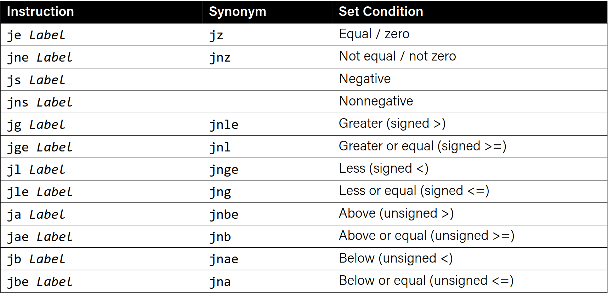

# Reverse engineering

```c
int add_to(int x, int arr[], int i){
    int sum = ?;// = x
    sum += ?;   // += arr[i]
    return ?;   // = sum
}
```

```asm
add_to:
    movslq %edx, %rdx           //sign extend %edx to %rdx
    movl %edi, %eax             //copy %edi to %eax (set sum to x) 
    addl (%rsi,%rdx,4), %eax    //add arr[i] to sum
    ret
```

----------

```c
int elem_arithmatic(int nums[], int y){
    int z = nums[?] * ?;    // = nums[0] * y
    int z -= ?;             // -= nums[1]
    int z >>= ?;            // = z >>= 2
    return ?;               // return z + 2
}
```

```asm
elem_arithmatic:
    movl %esi, %eax     //set z to y
    imull (%rdi), %eax  //multiply z by nums[0]
    sub 4(%rdi), %eax   //subtract nums[1] from z
    sarl $2, %eax       //shift z right by 2
    addl $2, %eax       //add 2 to z
    ret
```

----------

```c
long func(long x,  long* ptr){
    *ptr = ? + 1; // = x + 1
    long result = x % ?; // = x % (x + 1)
    return ?;   //result
}
```

```asm
func:
leaq 1(%rdi), %rcx
movq %rcx, (%rsi)
movq %rdi, %rax
cqto
idivq %rcx
movq %rdx, %rax
ret
```
----------


# Assembly Execution and %rip

**What does it mean for a program to execute?**

So far:
- The program can be stored in the memory or registers.
- Assembly instructions read/write values from/to memory or registers.
- Assembly instructions are stored in the memory.

- **%rip: stores the address of the next instruction to be executed.**

## %rip

```
00000000004004ed <sum_array>: (function name and location in memory)
  4004ed:	55                   	push   %rbp
  4004ee:	48 89 e5             	mov    %rsp,%rbp
  4004f1:	48 89 7d e8          	mov    %rdi,-0x18(%rbp)
  4004f5:	89 75 e4             	mov    %esi,-0x1c(%rbp)
  4004f8:	c7 45 fc 00 00 00 00 	movl   $0x0,-0x4(%rbp)
  4004ff:	c7 45 f8 00 00 00 00 	movl   $0x0,-0x8(%rbp)
  400506:	eb 1d                	jmp    400525 
  ...
  ...
```
The program counter (PC), known as %rip in x86-64, stores the address in the memory of the next instruction to be executed.

Usually the instructions are executed in order.

A special hardware on the cpu sets the program counter to the next instruction.

%rip += size of the instruction.

## Going in Circles

- How can we represent a loop in assembly?
- Key Idea: we can *interfere* with %rip abd set it back to an earlier instruction.

### Jump

- The `jmp` insturction is an unconditional jump that sets the program counter to the jump target.

```asm
jmp Label (direct jump) //directly jump to a memory address
jmp *Operand (indirect jump)
```

- Direct jump: 
`jmp 404f8 <loop+0xb> #jump to instruction at 0x404f8`
- Indirect jump:
`jmp *%rax #jump to instruction at address in %rax`


----------

**Example of direct jump:**

```asm
00000000004004ed <loop>:
4004ed: 55                          push %rbp
4004ee: 48 89 e5                    mov %rsp,%rbp
4004f1: c7 45 fc 00 00 00 00        movl $0x0,-0x4(%rbp)
4004f8: 83 45 fc 01                 addl $0x1,-0x4(%rbp)
4004fc: eb fa                       jmp 4004f8 <loop+0xb>
```

- This is an infinite loop that never breaks!
- After executing `<4004fc>` we return to `<4004f8>` and repeat the loop.

----------


## Control flow mechanics

- In C, we have flow statements like if, else, while, for...

```c
if(x > y){

}else{

}
```

Calculate the condition and jump to the appropriate branch.

Common pattern:
1- cmp S1, S2
2- je [target] or jne [target] or jl [target] ...


```asm
//jump if %edi > 2
cmp $2, %edi
jg [target]
```
----------



----------

**How does jump knows about compared values in the earlier instruction?**

### Control

- The CPU has special registers called condition codes that are like global variables.

- cmp compares via calculation (subtraction) and info is stored on the condition codes.

Most common condition codes:
- CF: Carry flag. Value of the most recent operation generated a carry out of the most significant bit. Used for detecting overflow for unsigned integers.
- ZF: Zero flag. Value of the most recent operation was zero.
- SF: Sign flag. Value of the most recent operation was negative.
- OF: Overflow flag. Value of the most recent operation generated a 2's complement overflow.

Example:
```
if we compute t = a+b
CF = (unsigned) t < (unsigned) a
ZF = t == 0
SF = t < 0
OF = (a < 0 == b < 0) && (a < 0 != t < 0)
```

- `cmp S1, S2`
Calculates S1 - S2 and sets the condition codes.
**Note the operand order!**

```asm
cmpb        Compare byte
cmpw        Compare word
cmpl        Compare double word
cmpq        Compare quad word
```

----------

The **test** insturction is similar to cmp but for AND. It does not sote the & result anywhere, it sets the condition codes. (also has testb ...)

```asm
test S1, S2     (S2 & S1)
```

Cool trick:
- `test S S` -> we can check the sign of S by checking the SF flag.

- `lea` does not update the condition codes.
- Logical operations (`xor`, etc.) set OF to zero.
- shift operations set CF to the last bit shifted out and OF to 0.
- `inc` and `dec` set OF and ZF but does not change carry flag.