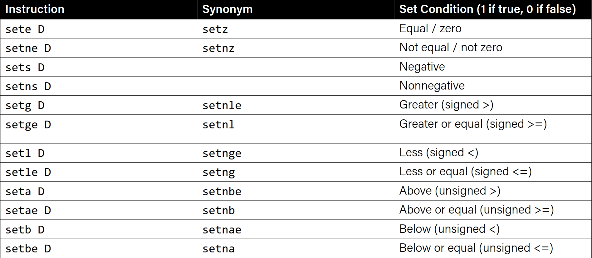
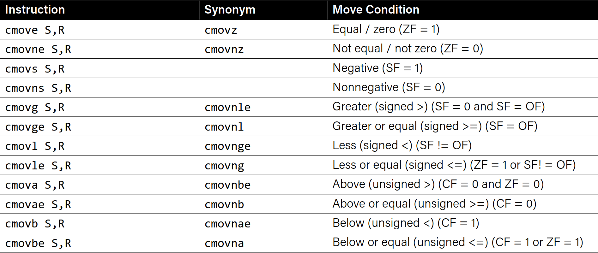

# Excercises
Let `%edi` store 0x10. Will we jump in the following cases?

```asm
cmp $0x10,%edi
je 40056f
add $0x1,%edi
```
Yes.

----------

```asm
test $0x10,%edi
je 40056f
add $0x1,%edi
```
No, 0x10 & 0x10 = 0x10, not 0.

----------

Let `%edi` store 0x5.

```asm
00000000004004d6 <if_then>:
4004d6: 83 ff 06 cmp $0x6,%edi
4004d9: 75 03 jne 4004de <if_then+0x8>
400rdb: 83 c7 01 add $0x1,%edi
4004de: 8d 04 3f lea (%rdi,%rdi,1),%eax
4004e1: c3 retq
```
The value of `%rip` will be 4004de after executing the `jne` instruction.
It will return 0xa.

# If statements

```c
int if_then(int param1){
    if ( ? ) {  // param1 == 6
        ? ;     // x ++;
    }
    return ? ;  // 2 * x
}
```

```asm
00000000004004d6 <if_then>:
    4004d6: cmp $0x6,%edi
    4004d9: jne 4004de
    4004db: add $0x1,%edi
    4004de: lea (%rdi,%rdi,1),%eax
    4004e1: retq
```

## Standard if-else after compilation

```c

if(...){
    ...;
}else{
    ...;
}
... ;
```

**Assembly psuedocode:**

- Test
- Jump to else body if text fails
- If-body
- Else-body
- Past else-body


----------
Excercise:

```c

if(...){    // arg > 3
    ...;    // ret = 10; 
}else{
    ...;    // ret = 0
}
... ;       // ret ++
```

```asm
400552 <+0>: cmp $0x3,%edi
400555 <+3>: jle 0x40055e <if_else+12>
400557 <+5>: mov $0xa,%eax
40055c <+10>: jmp 0x400563 <if_else+17>
40055e <+12>: mov $0x0,%eax
400563 <+17>: add $0x1,%eax
```
----------

# Loops

```c
void loop(){
    int i = 0;
    while(i < 100){
        i ++;
    }
}
```

```asm
0x0400570 <+0>: mov $0x0,%eax              // i = 0
0x0400575 <+5>: jmp 0x40057a <loop+10>
0x0400577 <+7>: add $0x1,%eax              // i++
0x040057a <+10>: cmp $0x63,%eax            // eax - 99
0x040057d <+13>: jle 0x400577 <loop+7>     // i <= 99
0x040057f <+15>: repz retq
```

Note that test statement is after the loop body.
Compiler negates the condition inside while (instead of i < 100, 99 - i >= 0)

----------

## While loops

```c
while(text){
    body ...
}
```
Assembly psuedocode:

- Jump to test
- Body
- Test
- Jump to body if test passes


### For loops

```c
for( init; test; update ){
    body ...
}
```

is equivalent to 

```c
init;
while(test){
    body ...
    update;
}
```
For loops and while loops are essentially same in the assembly.

Assembly psuedocode:

- Init
- Jump to test
- Body
- Update
- Test
- Jump to body if test passes


# Set instructions

- `set` instructions set a byte to 0 or 1
    - Reads the current state pf flags
    - Destination is a single byte register (e.g %al) or single-byte memory location
    - Does not perturb other bytes or register
    - Typically followed by `movzbl` to zero those bytes

Example:

```c
int small(int x){
    return x < 16;
}
```

```asm
cmp $0xf,%edi
setle %al           //set al to 1 if cmp result is less or equal
movzbl %al,%eax     //zero extend al to eax
retq
```




# Conditional moves

**cmovx** src,dst conditionally moves data in src to data in dst.
- Mov src to dst if x holds.
- src is memory address/register, dst is a register
- May be more efficient than branch
- Often seen with ternary operator

## Ternary operator

```c
    condition ? expressionIfTrue : expressionIfFalse
```
is similar to

```c
if(condition){
    expressionIfTrue;
}else{
    expressionIfFalse;
}
```

----------

```c
int max(int x, int y) {
return x > y ? x : y;
}
```

```asm
cmp %edi,%esi
mov %edi, %eax      //move x to eax
cmovge %esi, %eax   //if y >= x, move y to eax
retq
```



# Practices

```c
int signed_division(int x) {
return x / 4;
}
```

```asm
signed_division:
    leal 3(%rdi), %eax  //put x + 3 in %eax
    testl %edi, %edi    //test if x is negative
    cmovns %edi, %eax   //If x is nonnegative, move x to %eax
    sarl $2, %eax       //arithmetic shift right 2 bits (divide by 4)
    ret
```

Note that in signed division, -14 / 4 returns -3 instead of -4.

----------

```c
long loop(long a, long b){
    long result = ?;    //result = 1
    while (?){          //a < b
        result = ?;     //result = result * (a + b)
        a = ?;          //a = a + 1
    }
    return result;
}
```

```asm
// a in %rdi, b in %rsi
loop:
    movl $1, %eax
    jmp .L2
.L3
    leaq (%rdi,%rsi), %rdx
    imulq %rdx, %rax
    addq $1, %rdi
.L2
    cmpq %rsi, %rdi
    jl .L3
    rep; ret
```

----------

```asm
escapeRoom:
    leal (%rdi,%rdi), %eax  //eax = 2*x
    cmpl $5, %eax           
    jg .L3                  //if 2*x > 5, jump to .L3
    cmpl $1, %edi           
    jne .L4                 //if x != 1, jump to .L4
    movl $1, %eax           
    ret                     //return 1
.L3:
    movl $1, %eax           
    ret                     //return 1
.L4:
    movl $0, %eax
    ret                     //return 0
```

What should be passed into escapeRoom to return 1?

We should pass some x > 3 or x = 1.