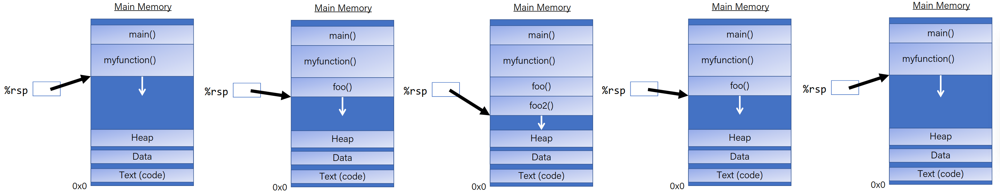
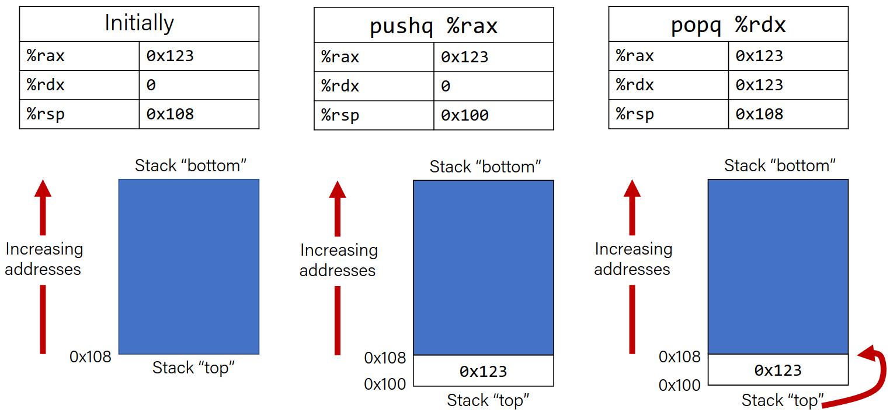
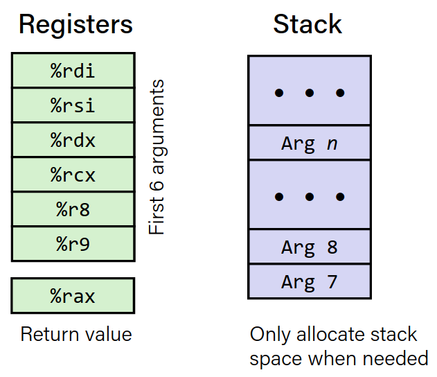
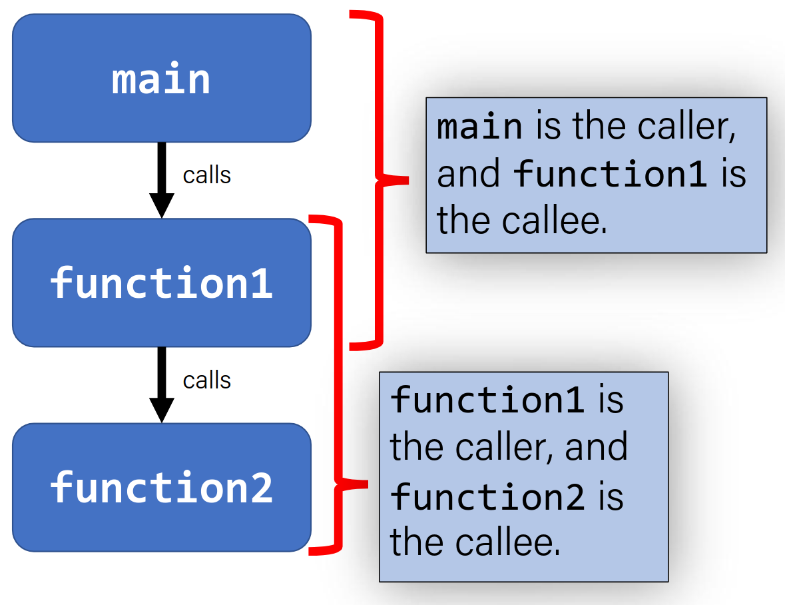
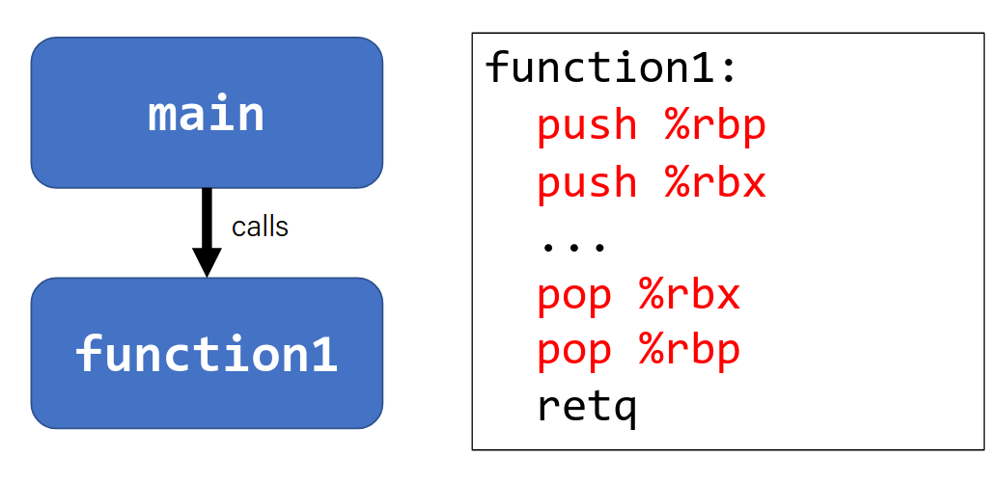
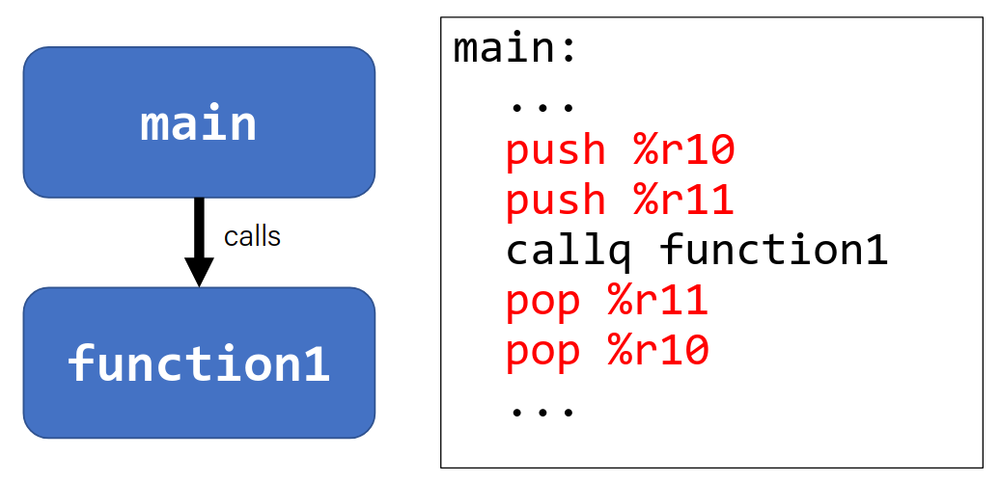

# x86-64 procedures

## Revisiting `%rip`

Stores the address of the next instruction to execute.

```c
void loop(){
    int i = 0;
    while(i < 100){
        i ++;
    }
}
```

```asm
0000000000400570 <loop>:
    0x400570 <+0>:  b8 00 00 00 00  mov $0x0,%eax
    0x400575 <+5>:  eb 03           jmp 0x40057a <loop+10>
    0x400577 <+7>:  83 c0 01        add $0x1,%eax
    0x40057a <+10>: 83 f8 63        cmp $0x63,%eax
    0x40057d <+13>: 73 f8           jle 0x400577 <loop+7>
    0x40057f <+15>: f3 c3           repz retq
```

the 0x03 in <+5> is the number of instruction bytes to jump relative to `%rip`.

while executing <+5>, `%rip` stores <+7>. We add 3 to it, it jumps to <+10>.

0x73 means jle. 0xf8 means jump back 8 bytes.
0xf8 means -8. `%rip` stores <+15>, -8 = <+7>.

Machine code instructions are stored in the main memory.
%rip is a register that stores a number, which is the address of the next instruction to execute.
Special hardware adds the size of the current instruction to %rip, and stores the result in %rip.

# Calling functions

**Pass control:**
-   %rip must be adjusted to execute the callee's instructions and then resume the caller's instructions afterwards.

**Pass data:**
-   We must pass any parameters and recieve any return value.

**Manage memory:**
-   We must handle any space needed by the callee on the stack.

**caller** function calls the **callee** function.

## The Stack

### %rsp

- %rsp is a special register that stores the address of the current "top" of the stack (bottom in our diagrams since stack grows downwards).

- %rsp must point to the same place before a function is called and after it returns, since stack frames go away after a function returns.

||
|:--:|


### push

- The push instruction pushes the data at the specified source onto the top of the stack, adjusting %rsp accordingly.
- Basically puts the given `quad word` into `%rsp` and subtracts 8 from `%rsp`.

```asm
pushq S ; R[%rsp] <- R[%rsp] - 8
        ; M[R[%rsp]] <- S
```

This is equivalent to

```asm
subq $8, %rsp
movq S, (%rsp)
```

- Sometimes instructions just explicitly decrement the stack pointer to make room for future data.
- Also compiler likes to allocate more space than needed <small>(maybe because it wants to align memory to the powers of 2/4 or something)</small>.

### pop

- The pop instruction pops the topmost data from stack and stores it in the specified destination, adjusting %rsp accordingly.

```asm
popq D ; D <- M[R[%rsp]]
       ; R[%rsp] <- R[%rsp] + 8
```

This does not remove, clear the data! It just changes %rsp to indicate the next push can overwrite that location.

|Stack Example|
|:--:|
||


## Pass control

**Problem:**
-   %rip stores the next instruction. When we call a function, we must remember the next caller instruction to resume after.

**Solution:**
- Push the next value of %rip to stack. Then call the function. When it is finished, put this value back into %rip and continue executing.


### Call and Return

The call instruction pushes the address of the next instruction on the stack and sets %rip to point to the beginning of the function

```asm
call Label
call *Operand
```

The ret instruction pops this instruction address from the stack and stores it in %rip.

```asm
ret
```

The stored %rip value is called return address. (DONT CONFUSE WITH RETURN VALUE)


#### Example:

Consider the assembly code:
```asm
do_smt:
    pushl 0x8
    call do_smt_else
    popq %rax   ;let this address be RA2
    retq
do_smt_else:
    ;some other assembly code that uses stack space
    retq    

```

Assume RA1 is the return address of the caller of do_smt.

|Stack representation <small>(Higher memory addresses to the left.)</small>|explanation|
|:-|-:|
|? / RA1 / |Start of do smt|
|? / RA1 / 8 / |Save 8 on the stack|
|? / RA1 / 8 / RA2 / |call do_smt_else|
|? / RA1 / 8 / RA2 / ?? /|do_smt_else allocates stack space|
|? / RA1 / 8 / RA2 / |do_smt_else deallocates stack space|
|? / RA1 / 8 / |`retq`, control returns to RA2|
|? / RA1 / |popq, `%rax` = 8|
|? / |retq, control returns to RA1|


## Pass data

First 6 arguments are stored in registers. The rest are stored on the stack. (arg 7 closer to %rsp)



### Example

```c
int main(int argc, char *argv[]) {
int i1 = 1;
int i2 = 2;
int i3 = 3;
int i4 = 4;
int result = func(&i1, &i2, &i3, &i4,
i1, i2, i3, i4);
...
}
int func(int *p1, int *p2, int *p3, int *p4,
int v1, int v2, int v3, int v4) {
...
}
```

```asm
    sub $0x18,%rsp          ;allocate stack space 
    movl $0x1,0xc(%rsp)     
    movl $0x2,0x8(%rsp)
    movl $0x3,0x4(%rsp)     
    movl $0x4,(%rsp)        ;put i1 - i4 on stack
    pushq $0x4              ;put i4 (8th argument) on stack
    pushq $0x3              ;put i3 (7th argument) on stack
    mov $0x2,%r9d           ;put i2 as the 6th argument
    mov $0x1,%r8d           ; ...
    lea 0x10(%rsp),%rcx
    lea 0x14(%rsp),%rdx
    lea 0x18(%rsp),%rsi
    lea 0x1c(%rsp),%rdi     ;put &i1 as the first argument
    callq 0x400546 <func>   ;call function
    add $0x10,%rsp          ;deallocate stack space
```

## Manage memory
-   We must handle any space needed by the callee on the stack.

There are 3 reasons for this:
-   We've run out of registers
-   The `&` operator is used on it, so we must generate an address for it
-   There are arrays or structs (need to use address arithmetic)

----------

```c
long caller(){
    long arg1 = 534;
    long arg2 = 1057;
    long sum = swap_add(&arg1, &arg2);
}
```

```asm
caller:
    subq $0x10, %rsp        ;16 bytes for stack frame
    movq $0x216, (%rsp)     ;store 534
    movq $0x421, 8(%rsp)    ;store 1057
    leaq 8(%rsp), %rsi      ;compute &arg2 as second arg
    movq %rsp, %rdi         ;compute &arg1 as first arg    
    call swap_add           ;call swap_add
```

### Register Restrictios

- When procedure yoo calls who:
    - yoo is the caller
    - who is the callee
- Can registers be used for temporary storage?


```asm
yoo:
    ...
    movq $15213, %rdx   ;15213 in rdx
    call who
    addq %rdx, %rax     ;now -3000 in rdx?
    ...
    ret
```
```asm
who:
    ...
    subq $18213, %rdx   ;15213 -> -3000
    ...
    ret
```

There is only one copy of registers for all programs and fuctions.

**Problem:** What if funcA is building up a value in register %r10 and calls funcB, which also uses %r10?

Solution: Make some registers caller-owned and some callee-owned.



**Caller-Owned:**
- Callee must save the existing value and restore it when done.
- Caller can store values and assume they will be preserved across function calls.

**Callee-Owned:**
- Callee does not need to save the existing data
- Caller's values can be overwritten by the callee. Caller should save the value if it needs to be preserved.

Note that callee-owned also means caller-saved. (and vice versa)

|Registers|Specialty|
|:--|--:|
|%rax|Return value|
|%rbx|Callee saved|
|%rcx|4th argument|
|%rdx|3rd argument|
|%rsi|2nd argument|
|%rdi|1st argument|
|%rbp|Callee saved|
|%rsp|Stack pointer|
|%r8|5th argument|
|%r9|6th argument|
|%r10|Caller saved|
|%r11|Caller saved|
|%r12 - %r15|Callee saved|

|||
|:-|-:|

# Recursion Example

```c
long factorial(long n) {
    long result;
    if (n > 1) {
        result = n * factorial(n - 1);
    } else {
        result = 1;
    }
    
    return result;
} 

int main(int argc, char *argv[]) {
    long num = 5;
    long factnum = factorial(num);
    printf("%ld! = %ld\n", num, factnum);
    return 0;
}
```

```asm
factorial:
  cmpq $1, %rdi
  jle .L3
  pushq %rbx
  movq %rdi, %rbx
  leaq -1(%rdi), %rdi
  call factorial
  imulq %rbx, %rax
  jmp .L2
.L3:
  movl $1, %eax
  ret
.L2:
  popq %rbx
  ret
.LC0:
  .string "%ld! = %ld\n"
main:
  subq $8, %rsp
  movl $5, %edi
  call factorial
  movq %rax, %rdx
  movl $5, %esi
  movl $.LC0, %edi
  movl $0, %eax
  call printf
  movl $0, %eax
  addq $8, %rsp
  ret
```
