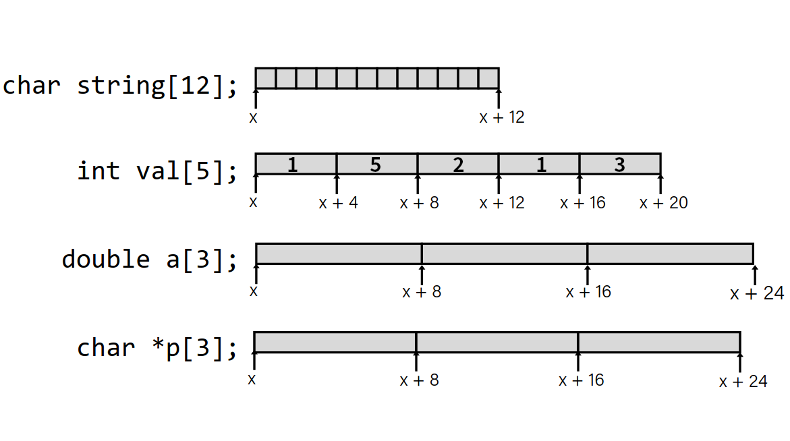
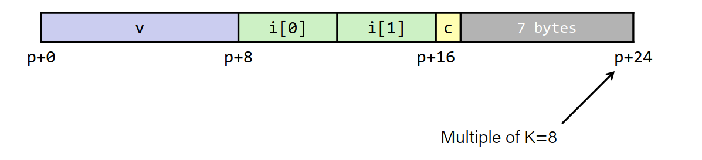

# Data and Stack Frames
## Array Allocation

**Basic Principle:**
- T A[L];
    - Array of data T and length L
    - Contiguously allocated region of L * sizeof(T) bytes in memory.




```c
int val[] = {1,5,2,1,3};
//assume that val is stored at address x
```

| Reference | Type | Value |
|-----------|------|-------|
| val[4] | int | 3 |
| val | int* | x |
| val + 1 | int* | x + 4 |
| &val[2] | int* | x + 8 |
| val[5] | int | ?? |
| *(val + 1) | int | 5 |
| val + i | int* | x + 4i |

**example**

```c
#define ZLEN 5
typedef int zip_dig[ZLEN];

zip_dig cmu = {1,5,2,1,3};
zip_dig mit = {0,2,1,3,9};
zip_dig ku = {3,4,4,5,0};

int get_digit(zip_dig z, int digit){
    return z[digit];
} 
```

```asm
get_digit:
    movl (%rdi,%rsi,4), %eax
    ret
```

----------

```c
void zincr(zip_dig z) {
    size_t i;
    for (i=0; i<ZLEN; i++)
        z[i]++;
}
```

```asm
                            ; %rdi = z
    movl $0, %eax           ; i = 0
    jmp .L3                 ; goto middle
.L4: ; loop:
    addl $1, (%rdi,%rax,4)  ; z[i]++
    addq $1, %rax           ; i++
.L3: ; middle
    cmpq $4, %rax
    jbe .L4                 ; if  i <= 4 goto loop
    ret
```

## Multidimensional (nested) Arrays

- T A[R][C];
    - 2D array of data type T
    - R rows and C columns
    - Type T element requires K types

Uses Row-Major ordering:

```
A[0][0] A[0][1] ...
A[1][0] A[1][1] ...
...
...
A[R-1][0]       A[R-1][C-1]
```


```c
zip_dig pgh[4] = { // int pgh[4][5]
    {1,5,2,1,3},
    {0,2,1,3,9},
    {3,4,4,5,0},
    {1,2,3,4,5}
};
```


### Accessing rows

**Row Vectors**
- A[i] is array of C elements.
- Each element is type T, requires K bytes.
- Starting address: A + i * (C * K)

```c
int *get_pgh_zip(int index){
    return pgh[index];
}
```

```asm
                            ; %rdi = index
leaq (%rdi,%rdi,4), %rax    ; 5 * index
leaq pgh(,%rax,4), %rax     ; pgh + (20 * index)
```

## Nested array element access

**Array Elements:**
- A[i][j] is element of type T, requires K bytes.
- Starting address: A + i*(C * K) + j * K
$$
= A + K \times (i \times C + j)
$$

```c
int get_pgh_digit (int index, int dig){
    return pgh[index][dig];
}
```

```asm
leaq (%rdi,%rdi,4), %rax        ; 5*index
addl %rax, %rsi                 ; 5*index+dig
movl pgh(,%rsi,4), %eax         ; M[pgh + 4*(5*index+dig)]
; assumes that pgh is a global array
```
Accessing:
-   Element access: `Mem[pgh + 4*(5*index+dig)]`


# Multi level array example

```c
zip_dig cmu = {0,2,1,3,9};
zip_dig mit = {1,5,2,1,3};
zip_dig ku  = {3,4,4,5,0};

int* univ[3] = {mit, cmu, ku};
```

- `univ` is an array of 3 zip_dig pointers.
- Each element is a pointer, that is 8 bytes.


```c
int get_univ_digit(size_t index, size_t digit)
{
    return univ[index][digit];
}
```

```asm
salq $2, %rsi               ; 4*digit
addq univ(,%rdi,8), %rsi    ; p = univ[index] + 4*digit
movl (%rsi), %eax           ; return *p
ret
```

Here, we use one more level of indirection. This is different than 2D arrays.

Computation:
-   Element access: `Mem[Mem[univ+8*index]+4*digit]`
-   Must do two memory reads


# NxN matrix code

**Fixed dimensions**
- Known value N at compile time

```c
#define N 16
typedef int fix_matrix[N][N];
/* Get element a[i][j] */
int fix_ele(fix_matrix a, size_t i, size_t j) {
    return a[i][j];
}
```

**Variable dimensions - explicit indexing**
- Assume it is int*
- Traditional way to implement dynamic arrays

```c
#define IDX(n, i, j)((i)*(n)+(j))
/* Get element a[i][j] */
int vec_ele(size_t n, int *a, size_t i, size_t j) {
return a[IDX(n,i,j)];
}
```

**Variable dimensions**
- GCC now supports using a[X][Y]!

```c
/* Get element a[i][j] */
int var_ele(size_t n, int a[n][n], size_t i, size_t j) {
return a[i][j];
}
```

## 16x16 Matrix Example

```c
/* Get element a[i][j] */
int fix_ele(fix_matrix a, size_t i, size_t j) {
return a[i][j];
}
```

```asm
; a in %rdi, i in %rsi, j in %rdx
salq $6, %rsi               ; 64*i
addq %rsi, %rdi             ; a + 64*i
movl (%rdi,%rdx,4), %eax    ; M[a + 64*i + 4*j]
ret
```
If the matrix size is not a power of 2 we can use `imulq` instead of `salq`.


todo add reverse engineering example


# Structure Represenantation

```c
struct rec {
    int a[4];           //16 bytes
    int i;              //4 bytes
    struct rec *next;   //8 bytes
}                       //in total 28 bytes
```

- Structs allocate consecutive blocks of memory
    - Big enough to hold all the fields

- Fields ordered according to the decleration
    - Even if another ordering could yield a more compact representaion

- Compiler determines overall size + positions of fields

```c
int *get_ap(struct rec *r, size_t idx)
{
    return &r->a[idx];
}
```

```asm
; r in %rdi, idx in %rsi
leaq (%rdi,%rsi,4), %rax 
; since a is at the start of our struct
ret
```

----------

### Following linked list

```c
struct rec {
    int a[4];
    int i;
    struct rec *next;
};

void set_val (struct rec *r, int val) {
    while (r) {
        int i = r->i;
        r->a[i] = val;
        r = r->next;
    }
}
```

```asm
.L11:                           ; loop:
    movslq 16(%rdi), %rax       ; i = M[r+16]
    movl %esi, (%rdi,%rax,4)    ; M[r+4*i] = val
    movq 20(%rdi), %rdi         ; r = M[r+20]
    testq %rdi, %rdi            ; Test r
    jne .L11                    ; if !=0 goto loop
```

## Aligned Data

- Compiler may insert padding to ensure that each field is aligned properly
    - Primitive data type requires K bytes
    - Address must be a multiple of K

Advised on x86-64, required on some architectures

```c
struct S1{
    char c;
    int i[2];
    double v;
} *p;
```


### Spesific Cases of alignment

Primitive data type requires K bytes => Address must be a multiple of K.


- 1 byte: char
    - no requirement
- 2 bytes: short
    - The lowest bit in the address must be 0
- 4 bytes: int, float
    - The lowest two bits in the address must be 0
- 8 bytes: double, long, char*
    - The lowest three bits in the address must be 0
- 16 bytes: long double (GCC on linux)
    - The lowest four bits in the address must be 0


## Overall Alignment

For the largest K,
The total size of the struct must be a multiple of K.



### Saving Space

- Put large data types first!

