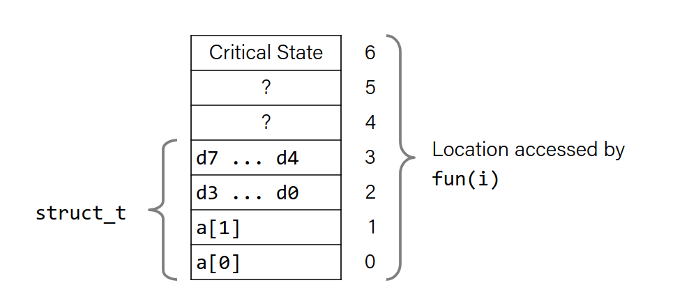

# Security vulnerabilities

### Back to structs: [(last lecture)](./lec19.md)

When defining structs, to waste less space, define the largest data type first, then the smaller ones. This way, we will have less padding inside the struct.

## Floating Point

We are using SSE3.

In order to deal with floating point numbers, we have 16 more registers each 16 bytes (XMM registers).

You can treat these registers as:
- 16 single byte integers
- 8 16-bit integers
- 4 32-bit integers
- 4 single-presicion floating point numbers
- 2 double-presicion floating point numbers
- 1 single-presicion floating point number
- 2 double-presicion floating point numbers

## SIMD operations

If we have 4 single-presicion floating point numbers, we can do 4 operations at the same time.

TODO add picture.

### FP basics

- Arguments passed in %xmm0, %xmm1...
- Return resulted in %xmm0
- All xmm registers are caller-saved

```c
float fadd(float x, float y){
    return x + y;
}

double dadd(double x, double y){
    return x + y;
}
```

```asm
fadd: ;x in %xmm0, y in %xmm1
    addss %xmm1, %xmm0
    ret

dadd: ;x in %xmm0, y in %xmm1
    addsd %xmm1, %xmm0
    ret
```

Note that the last letter in adds**s** and adds**d** stands for single and double precision.

### FP Memory Referencing

- Integer (and pointer) arguments passed in regular registers
- FP arguments passed in %xmm0, %xmm1...
- Different mov instructions for xmm registers, and memory to xmm registers

```c
double dincr(double *p, double v)
{
    double x = *p;
    *p = x + v;
    return x;
}
```

```asm
dincr: ; p in %rdi, v in %xmm0
movapd %xmm0, %xmm1 ; Copy v
movsd (%rdi), %xmm0 ; x = *p
addsd %xmm0, %xmm1 ; t = x + v
movsd %xmm1, (%rdi) ; *p = t
ret
```

TODO add the full list

## Memory allocation example

```c
char big_array[1L<<24]; /* 16 MB */
char huge_array[1L<<31]; /* 2 GB */
int global = 0;
int useless() { return 0; }
int main ()
{
    void *p1, *p2, *p3, *p4;
    int local = 0;
    p1 = malloc(1L << 28); /* 256 MB */
    p2 = malloc(1L << 8); /* 256 B */
    p3 = malloc(1L << 32); /* 4 GB */
    p4 = malloc(1L << 8); /* 256 B */
    /* Some print statements ... */
}

//local in stack
//p1..p4 in heap
//big_array - huge_array in data segment
//main and useless in text part
```

TODO add image (2)

# Buffer Overflow

## Memory Referencing Bug Example

```c
typedef struct {
    int a[2];
    double d;
} struct_t;

double fun(int i) {
    volatile struct_t s; // volatile keyword prevents compiler from optimizing
    s.d = 3.14;
    s.a[i] = 1073741824; /* Possibly out of bounds */
    return s.d;
}
```

Sample result (system spesific):
```
fun(0) → 3.14
fun(1) → 3.14
fun(2) → 3.1399998664856
fun(3) → 2.00000061035156
fun(4) → 3.14
fun(6) → Segmentation fault
```

Explanation:


## Buffer Overflow in a Nutshell

- C does not check array bounds
    - Many Unix/Linux/C functions don't check argument sizes,
    - Allows overflowing of buffers

- "Buffer Overflow": writing past an array

- Characteristics of the traditional Linux memory layout provide
opportunities for malicious programs
    - Stack grows “backwards” in memory
    - Data and instructions both stored in the same memory


## String library code

```c
/* Get string from stdin */
char *gets(char *dest)
{
    int c = getchar();
    char *p = dest;
    while (c != EOF && c != '\n') {
        *p++ = c;
        c = getchar();
    }
    *p = '\0';
    return dest;
}
```

- No way to limit the number of characters read.
- Similar problem with other library functions.

Example:

```c
/* Echo Line */
void echo()
{
    char buf[4]; /* Way too small! */
    gets(buf);
    puts(buf);
}

void call_echo(){
    echo();
}
```

If you type in more than 4 characters, you will get a segmentation fault.

Disassembly:

```asm
echo:
00000000004006cf <echo>:
4006cf: 48 83 ec 18         sub $0x18,%rsp 
;open 24 bytes on stack (4 for buf, 20 unused)
4006d3: 48 89 e7            mov %rsp,%rdi
4006d6: e8 a5 ff ff ff      callq 400680 <gets>
4006db: 48 89 e7            mov %rsp,%rdi
4006de: e8 3d fe ff ff      callq 400520 <puts@plt>
4006e3: 48 83 c4 18         add $0x18,%rsp
4006e7: c3                  retq

call_echo:
4006e8: 48 83 ec 08         sub $0x8,%rsp
4006ec: b8 00 00 00 00      mov $0x0,%eax
4006f1: e8 d9 ff ff ff      callq 4006cf <echo>
4006f6: 48 83 c4 08         add $0x8,%rsp
4006fa: c3                  retq
```

By overriding stack, we can even change the return address of the function!

TODO add images

## Why is buffer overflow a problem?

Attackers can overwrite interesting data.

Simplest form (sometimes called "stack smashing")
- Try to change the return address of a function

# Code injection attacks

# Avoiding

- Use fgets instead of gets strncpy instead of strcpy
- dont use scanf with %s conversion specifier
    - use fgets to read the string
    - Or use %ns where n is a suitable integer

- Randomized stack offsets

- Non executable code segments

TODO HERE

## Stack canaries

Place a special value "canary" on stack beyond the buffer, and check it before returning from function.

GCC implementation:
-fstack-protector

- Now the default

Something like `fs:0x28` (0x28 is the offset of the canary)

TODO add asm code

# Return oriented programming attacks
