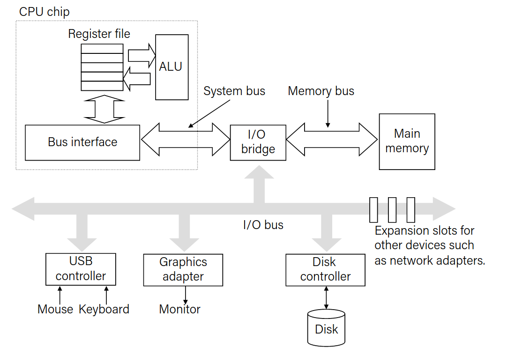

# Memory abstraction

- Write
    - Transfer data from CPU to memory
    - Store operation

- Read
    - Transfer data from memory to CPU
    - Load operation

## Traditional Bus structure

- A bus is a collection of parallel wires that carry address, data and control signals

- Busses are typically shared by multiple devices

### Memory read transaction

Load operation: `movq A, %rax`

- CPU places address A on the memory bus.
- The main memory reads A from the memory bus, retrieves word x, and places it on the bus.
- CPU read word x from the bus and copies it into register %rax.

Store operation: `movq %rax, A`

- CPU places address A on bus. Main memory reads it and waits for the corresponding data to arrive.
- CPU places data word y on the bus.
- Main memory reads word y from the bus and stores it at address A.

## Storage technologies and trends

### Random-Access Memory (RAM)

- Key Features
    - RAM is traditionally packaged as a chip
    - Basic storage unit is normally a `cell` (one bit pre cell)
    - Multiple RAM chips form a memory.

||Trans. per bit|Access time|needs refresh|needs EDC|Cost|Applications|
|-|-|-|-|-|-|-|
|SRAM|4 or 6|1x|No|Maybe|100x|Cache memories|
|DRAM|1|10x|Yes|Yes|1x|Main memory, frame buffers|

>EDC: Error Detection and Correction

- SRAM scales with semiconductor technology which is reaching its limits.
- DRAM scaling limited by minimum capacitance

#### Enhanced DRAM (EDRAM)

- Operation of DRAM cell has not changed since its invention in 1970

- DRAM cores with better logic and faster io: 
    - Synchronus DRAM : SDRAM
    - Double Data Rate SDRAM : DDR SDRAM
        - DDR: 2 bit prefetch buffer
        - DDR2: 4 bit prefetch buffer
        - DDR3: 8 bit prefetch buffer
        - DDR4: 16 bit prefetch buffer

### Storage Technologies

- Nonvolatile memory
    - Flash memory
    - Solid-state drive (SSD)

- Magnetic disk
    - Hard disk drive (HDD)
    

> Volitile memory: Loses information when powered off

#### Disk Geometry

-   Disks consist of *platters* with two *surfaces*
-   Each surface consists of concentric rings called *tracks*
-   Each track consists of *sectors* seperated by *gaps*

> Capacity: maximum number of bits that can be stored

- Capacity is calculated using:
    -   Recording Density (bits per inches)
    -   Track Density (tracks per inches)
    -   Areal Density = Recording density x Track density

Modern disks partition tracks into *recording zones*

- Average time to access a sector on a magnetic disk is calculated using:
avg time to seek + avg rotation time + avg transfer time

- Seek time:
Time to position heads over.
Takes around 3-9ms

- Rotational latency:
Waiting for the target sector to pass under heads.
Calculated by: .5 * (1/RPM) * 60 seconds
Typically 7200 RPMS

- Transfer time:
Time to read the bits in the sector
Calculated using: (1/RPM) * 1/(number of sectors/track) * 60 seconds

Reading the first bit is the most expensive operation, reading the rest is free.

SRAM access time is around 4ns/doubleword, DRAM about 60.
Disk is 40k times slower than SRAM and 2.5k times slower than DRAM.

#### Solid State Disks SSD's

Contains Blocks that contain Pages.
-   Pages: 512KB - 4KB, Blocks: 32 to 128 pages
-   Data is read-written in units of pages
-   Page can be written only after its blocks has been erased
-   A block wears out after about 100k repeated writes

