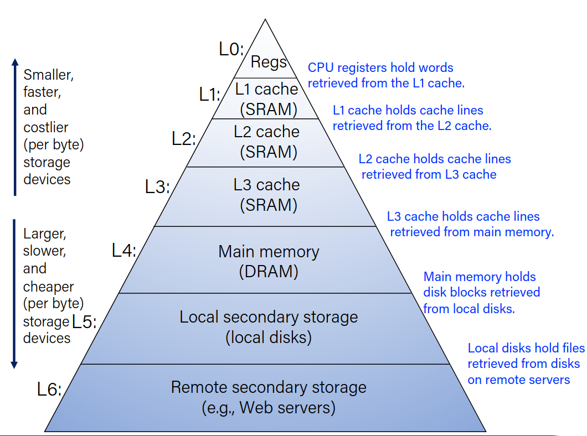
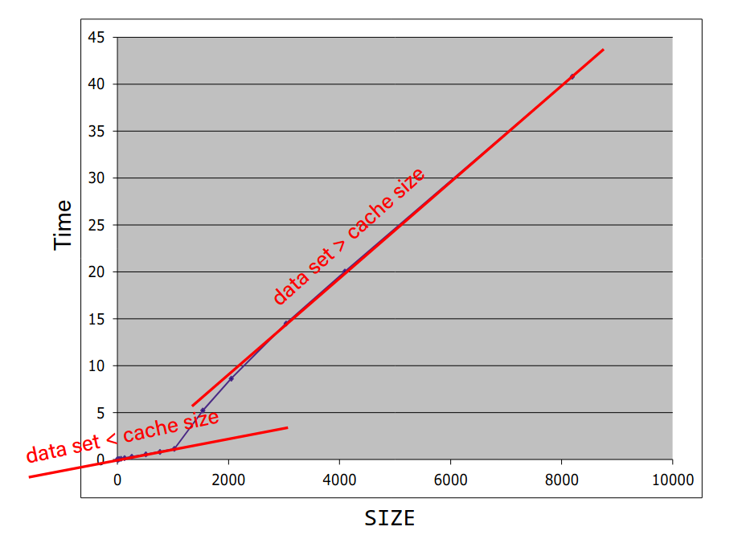

# Locality

- **Locality:** Programs tend to use data and instructions with adresses near or equal to those they have used recently.

- Temporal Locality: Recently referenced items are likely to be referenced again. 

- Spatial Locality: Items with nearby adresses tend to be referenced close together in time. 

## Memory Hierarchy



|Cache type| What is cached| Where | Latency (cycles)| Managed by|
|--|--|--|--|--|
|Registers|4-8 byte words| CPU core|0|Compiler|
|TLB|Adress translations|on-chip TLB|0|Hardware MMU|
|L1 cache| 64-byte blocks| On-chip L1| 4 | Hardware|
|L2 cache| 64-byte blocks| On-chip L2| 10 | Hardware|
|Virtual Memory|4KB pages|Main memory|100| Hardware + OS|
|Buffer Cache|Parts of files|Main memory|100|OS|
|Disk Cache|Disk sectors|Disk controller|100k|Disk firmware|
|Network Buffer Cache|Parts of files|Local disk| 10m|NFS client|
|Browser Cache|Web pages|Local disk|10m| Web browser|
|Web Cache|Web pages|Remote server| 1b| Web proxy server|

## Example

Consider 

```c
int array[SIZE];
int sum = 0;

for(int i = 0; i< 20000; i++){
    for(int j = 0; j < SIZE; j++){
        sum += array[j];
    }
}
```

The execution time graph looks like:



We would except a linear growth as the SIZE changes.
However, as the SIZE increases, when dataset < cache size, it grows linear, but when dataset > cache size, its slope changes drastically.

## Processor-Memory bottleneck

The problem is, while processor performance has increased really fast, the bus latency / bandwidth evolved much slower.

We lose a lot of time waiting for memory.

We use caches to reduce the number of memory accesses.

# Cache memories

- Cache memories are small, SRAM-based memories that are used to store recently used data and instructions.

- CPU first checks the cache memory to see if the data is there. If it is, it is used. If not, it is fetched from the main memory.

## General cache concepts

Cache memories have blocks. When a memory address is accessed, cache stores the whole block around that address. 

**Hit:**
-   If the data we want is already in cache, that is called a hit.

**Miss:**
-   If the data we want is not in the cache, we call that a miss.
-   When a miss happens, that block is fetched from the memory and stored on the cache.
-   Since cache is small, we need to determine where to store that block and what to delete instead of it using *Placement policy* and *Replacement policy*.

#### Types of misses

- Cold (compulsory) Miss:
    - Cold misses occur because the cache is empty.
    - Happens at the start of the program.

- Conflict Miss:
    - Most caches limit blocks at level k+1 to a small subset of the block positions at level k. (By level, I mean L1 and L2 for example)
    - Conflict misses occur when the cache is large enough, but multiple data objects all map to the same block.
        - For example, if blocks 0 and 8 map to the same block in the cache, referencing 0, 8, 0, 8, ... would miss every time.
    
- Capacity Miss:
    - occurs when the set of active cache blocks is largen than the cache.

## Locality's effect on speed example

Consider these two functions:

```c
int sum_array_rows(int a[M][N]){
int i, j, sum = 0;
for (i = 0; i < M; i++)
    for (j = 0; j < N; j++)
        sum += a[i][j];
return sum;
}
```

```c
int sum_array_cols(int a[M][N]){
int i, j, sum = 0;
for (j = 0; j < N; j++)
    for (i = 0; i < M; i++)
        sum += a[i][j];
return sum;
}
```

Since arrays are row based in C, the second function jumps over some values and returns back.
-   `a[0][0] = a[0]`, `a[1][0] = a[N]`, `a[2][0] = a[2*N]` while `a[0][1] = a[1]` and `a[0][2] = a[2]`. 
-   The second function does not have good locality, it is slower.

We should keep the stride of the innermost loops to a minimum.

## Cache Performance Metrics

- Huge speed difference between cache hit and miss. (up to 100x)
- Miss Rate:
    - Misses / Accesses, 1 - Hit Rate
- Hit Time:
    - Time to deliver a block from cache to the processor
- Miss Penalty:
    - Additional time required because of a miss
- Average Memory Access Time:
$$ HT + MR \times MP$$


Sometimes, %99 hit rate is twice as faster than %97 hit rate.

### Why have more than one cache?

We try to optimize L1 for hit time and L2 for miss rate.

- Miss rate:
    - L1: 3-10%
    - L2: Less than 1%
- Hit time:
    - L1: 4 clock cycles
    - L2: 10 clock cycles
- Miss penalty:
    - P = 50-200 cycles for missing in L2 and going to main memory.

# Cache Organization

- **Block Size** (B): Unit of transfer between cache and main memory.
    - Given in bytes and is a power of 2.
    - Blocks consist of adjacent bytes
        - <small>spatial locality</small>
- Block Offset:
    - The rightmost log_2(B) = b bits of address tell you which byte within a block. 
    - Also can be calculated with address % block size.


- **Cache Size** (C): Amount of data the cache can store
    - Given in bytes (C) of number of blocks (C/B)

We need a way to determine where to put / look for a memory address in the cache.

We will use a hash table.

----------

We will use the next log_2(C/B) = s bits (number of sets) in the address to determine a block's index.

- Map to cache index from block number.
- Consecutive blocks go in consecutive cache indices.

However, the cache needs to know which block it is storing, therefore we also have **tags**.

- **Tag** is the rest of the address:
    - t bits = m - s - b

||m-b bits|b bits|
|-|-|-|
|m-bit address:|Block number -> Tag(t bist) +  Index(s bits)|Block offset|

- Index: Tells you to where to look in the cache
- Tag: Let's you know if that location contains the block you want
- Offset: Selects specified start byte within block.

### Example

- Using 8-bit addresses
- B = 4 bytes, C = 32 bytes
    - b = 2, s = 3, t = 3

- What are the fields for address 0xBA

```
0xBA = 1011 1010
Block offset = 10   
Index = 110
Tag = 101
```

