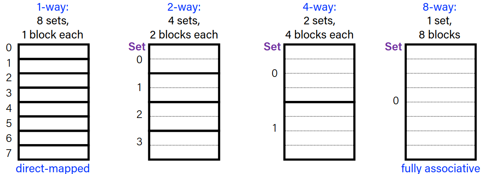
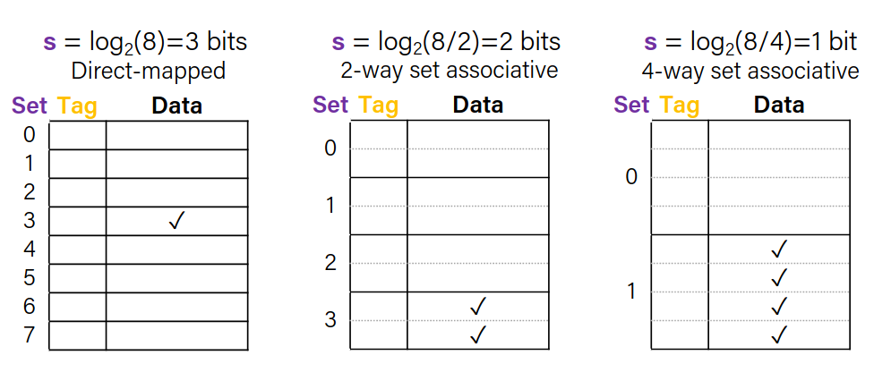
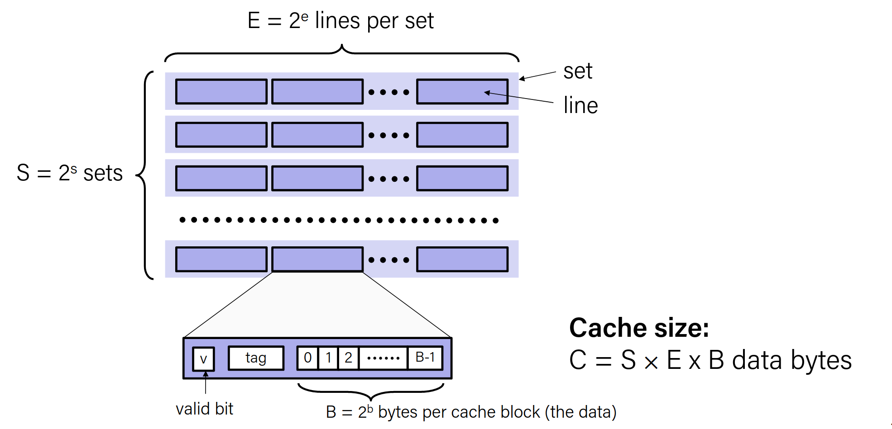
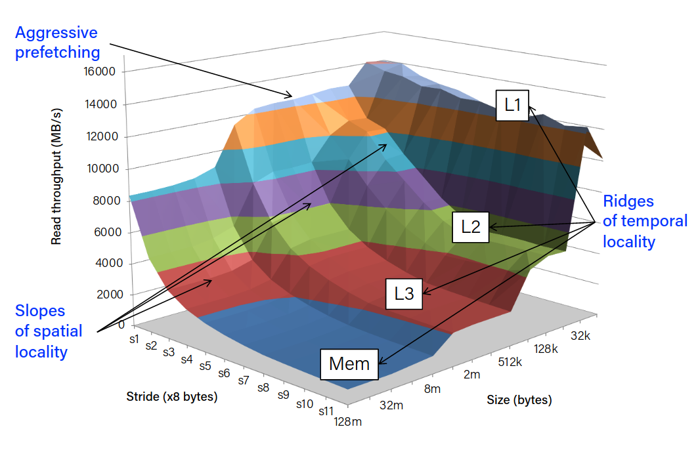

# More on Cache Memories

## Direct Mapped Cache Problem

Assume that the addresses A, B and C map to the same cache index. 
If we keep accessing A, B, C, A, B, C, A, B, C, ... we will have a cache miss every time (conflict misses).

**Solution:**

### Associativity

- Each address is still mapped to a single set.
- Sets can store more than one block.

If each set contains **E** blocks, we call that a **E-way associative cache**.

- Number of sets: S = (C/B)/E
    - Remember that C is the size of cache in bytes and B is the block size in bytes. C/B gives us the number of blocks in the cache.
- Now the calculation is:
    - **Block offset**: b = log_2(B)
    - **Index**: s = log_2(S) = log_2(C/B/E)
    - **Tag**: t = Rest of the address

|Tag|Index|Offset|
|---|-----|------|
|t bits|s bits|b bits|

- As the associativity increases:
    - The number of sets decreases
    - Index bits (s) decreases
    - The number of blocks per set increases
- As the associativity decreases:
    - The number of sets increases
    - Index bits (s) increases
    - The number of blocks per set decreases

- Fully associative cache:
    - Only one set
    - E = C/B
    - s = 0
- Direct mapped cache:
    - E = 1
    - s = log_2(C/B)
    - Each set contains only one block

#### Example

- For a cache memory: 
    - block size: 16 bytes
    - capacity: 8 blocks
    - address: 16 bits long

Place `0x1833` in a directly mapped, 2 way associative, and 4 way associative caches.

Solution:

First of all, compute the numbers:
B = 16
C = 8 * 16 = 128
C/B = 8

`0x1833` = `0001 1000 0011 0011`

|Directly Mapped|2 Way Associative|4 Way Associative|
|---------------|-----------------|-----------------|
| E = 1 | E = 2|E = 4
| S = C/B = 8 | S = 4 | S = 2
| b = log_2(B) = 4 | b = 4 | b = 4
| s = log_2(S) = 3 | s = 2 | s = 1
| t = 16 - 4 - 3 = 9 | t = 16 - 4 - 2 = 10| t = 16 - 4 - 1 = 11
| block offset = `0011` = `0x3` | block offset = `0011` = `0x3` |block offset = `0011` = `0x3`
| index = `011` = `0x3` | index = `11` = `0x3`|index = `1` = `0x1`
| tag = `0 0011 0000` = `0x030` | tag = `0 0001 1000` = `0x018`|tag = `0 0000 1100` = `0x00C`

<small>the calculations for 2 way and 4 way might be wrong because I trusted github-copilot on those</small>

#### Block Placement

- Any empty block can be used to store a new block
- If there are no empty blocks, we need to replace an existing block
    - For directly mapped cache, we have no choice
    - Otherwise, caches usually use **least recently used (LRU)** replacement policy

## General Cache Organization

### Cache Read

- We store a valid bit for each block in cache.
- When we read a block from memory:
    - Locate the set
    - Check if any line in set contains our tag
    - If yes + valid bit = 1, we have a cache hit, locate the data using the offset

### Cache Write

There are some problems with cache writes:
- Multiple copies of the same data exists
    - in L1, L2 caches, main memory and disk
- Two options on a write-hit:
    - **Write-through**: write to both cache and memory
    - **Write-back**: write to cache only, write to memory when the block is removed from cache
        - We need a **dirty bit** to indicate if the block has been modified
- Two options on write-miss:
    - **Write-allocate**: Store the block in cache and write to cache.
        - <small> good if more writes follow</small>
    - **No-write-allocate**: write to memory directly, do not store the block in cache
- Typically we use:
    - Write-through + no-write-allocate
    - Write-back + write-allocate

#### Write-back, Write-allocate example

Assume that we have the address (G) in one of our blocks.
Assume the address (F) is mapped to the same set as (G) and we have a direct mapped cache.

- `mov 0xFACE (F)`
    - Write miss as F is not in cache
    - Load F to cache (G is evicted)
    - Change F's value to 0xFACE on the *cache*
    - Set dirty bit to 1 for F
- `mov 0xBEEF (F)`
    - Write hit as F is in cache
    - Change F's value to 0xBEEF on the *cache*
    - Set dirty bit to 1 for F
- `mov (G) %ax`
    - Read miss as G is not in cache
    - Load G to cache (F is evicted)
        - Before evicting F, because the dirty bit is set, we write F to memory
    - Read G's value from cache and store it in %ax

# Memory Mountain

Memory mountain is the read troughput as a function of spatial and temporal locality.

## Writing Cache Friendly Code

- Focus on the innermost loops of the common functions and try to optimize them

- Minimize the misses for the common functions
    - Repeated references to variables. <small> temporal locality</small>
    - Stride-1 reference patterns are good. <small> spatial locality</small>
        -  <small> stride = distance between two consecutive references</small>

