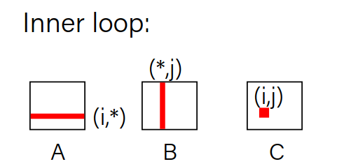
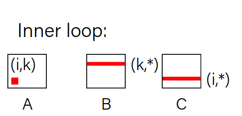
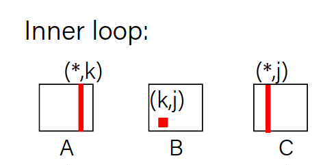
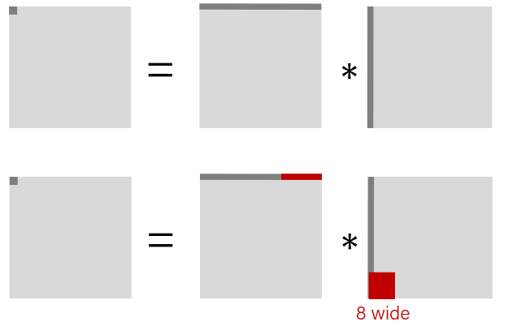
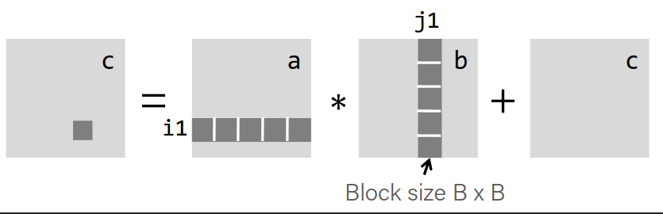

# Caching

All caching depends on the locality.

# Writing cache friendly code

- Make the common case go fast
    - Focus on the inner loops of the core functions

- Minimize the misses in the inner loops
    - Repeated references to variables (temporal locality)
    - Stride-1 reference patterns are good (immediate next element) (spatial locality)

## Rearranging loops (exploit spatial locality)

### Example: Matrix Multiplication

#### i j k

$$
c_{ij} = \sum_{k=1}^n a_{ij} \times b_{kj}
$$

Description:
- Multiply N x N matrices
- Matrix elements are doubles
- N reads per source element
- N values summed up per destination

```c
/*ijk*/
for(i = 0; i< N; i++){
    for(j = 0; j < N; j++){
        sum = 0.0;
        for(k = 0; k < N; k++){
            sum += a[i][k] * b[k][j];
        }
        c[i][j] = sum;
    }
}
```



##### Miss rate analysis

- Assume block size = 32 bytes (4 doubles)
- N is very large
- Cache is not big enough to hold multiple rows

**We only consider the innermost loop:** `sum += a[i][k] * b[k][j];`

- Miss rate for A:
    - Since a single block can hold 4 doubles and A is stride-1, we have .25 miss rate.
- Miss rate for B:
    - Because B's row changes each iteration (jumps over multiple elements), we have a miss rate of 1.
- Miss rate for C:
    - Since C is not referenced at all in the inner most loop, we have a miss rate of 0.

#### k i j

```c
/*kij*/
for(k = 0; k < N; k++){
    for(i = 0; i < N; i++){
        r = a[i][j];
        for(j = 0; j < N; j++){
            c[i][j] += r * b[k][j];
        }
    }
}
```



##### Miss rate analysis

- Miss rate for A:
    - Since A is not referenced at all in the inner most loop, we have a miss rate of 0.
- Miss rate for B:
    - Since B is stride-1, we have a miss rate of .25.
- Miss rate for C:
    - Since C is stride-1, we have a miss rate of .25.

`i k j` order is similar to `k i j` order.

#### j k i

```c
/*jki*/
for(j = 0; j < N; j++){
    for(k = 0; k < N; k++){
        r = b[k][j];
        for(i = 0; i < N; i++){
            c[i][j] += a[i][k] * r;
        }
    }
}
```



##### Miss rate analysis

- Miss rate for A:
    - Since A's row changes each iteration (jumps over multiple elements), we have a miss rate of 1.
- Miss rate for B:
    - Since B is not referenced at all in the inner most loop, we have a miss rate of 0.
- Miss rate for C:
    - Since C's row changes each iteration (jumps over multiple elements), we have a miss rate of 1.

This is the worst case. `k j i` order is also similar to this.


## Using blocking (exploit temporal locality)

- Matrix elements are doubles
- Cache block size = 64 bytes (8 doubles)
- Cache size << n

### Without blocking

```c
c = (double *) calloc(sizeof(double), n*n);
/* Multiply n x n matrices a and b */
void mmm(double *a, double *b, double *c, int n) {
    int i, j, k;
    for (i = 0; i < n; i++)
        for (j = 0; j < n; j++)
            for (k = 0; k < n; k++)
                c[i*n + j] += a[i*n + k] * b[k*n + j];
}
```

First iteration: n/8 + n = 9/8 n misses.

||
|-|
|<center>Cache after the first iteration</center>|

Similarly, second iteration also has n/8 + n = 9/8 n misses.

So in total, we have 9/8 n^3 misses.

### With blocking

```c
c = (double *) calloc(sizeof(double), n*n);
/* Multiply n x n matrices a and b */
void mmm(double *a, double *b, double *c, int n) {
int i, j, k;
for (i = 0; i < n; i+=B)
for (j = 0; j < n; j+=B)
for (k = 0; k < n; k+=B)
/* B x B mini matrix multiplications */
    for (i1 = i; i1 < i+B; i++)
    for (j1 = j; j1 < j+B; j++)
    for (k1 = k; k1 < k+B; k++)
        c[i1*n+j1] += a[i1*n + k1]*b[k1*n + j1];
}
```



Assume that 3 blocks fit into cache: 3B^2 < C

First iteration: 
- $B^2 / 8$ misses for each blocks
- $2n/B * B^2 / 8 = nB / 4$ (ommitting C)

||
|-|
|<center>Cache after the first iteration</center>|

Total misses: (n^2 / B^2) * nB / 4 = n^3 / 4B

- No Blocking: ${9\over{8}} \times n^3$
- Blocking: ${1 \over 4B} \times n^3$

- We should take largest possible B such that $3B^2 < C$

# Optimization

- Targeted, intentional optimizations alleviate bottlenecks and resut in big gains. But only optimize where necessary.

**In Summary**
-   If doing something is rare, and only done on small inputs, don't optimize it.
-   If doing things alot or on big inputs, make it's big O cost reasonable
-   let gcc do its magic
-   optimize explicitly as a last resort

## gcc optimization

```bash
gcc -O0     # literal translation of C
gcc -O2     # enable most optimizations
gcc -Og     # enable optimizations that do not interfere with debugging
gcc -O3     # more aggressive but trades for file size
gcc -Os     # optimize for size
gcc -Ofast  # ignore conventions
``` 

### gcc optimizations

GCC optimizations:
-   Constant folding
-   Common subexpression elimination
-   Dead code elimination
-   Strength reduction
-   Code motion
-   Loop Unrolling
-   Tail Recursion

Gcc optimizations target:
-   Static instruction count
-   Dynamic instruction count
-   Cycle count / execution time


#### Constant folding

gcc pre-calculates constants at compile-time where possible.

```c
int seconds = 60 * 60 * 24 * n_days;
```

Compiler pre-calculates `60 * 60 *24 before hand`

Since compiler pre-calculates constants, we should try to write our code more readable.

```c
int fold(int param){
    char arr[5];
    int a = 0x107;
    int b = a * sizeof(arr);
    int c = sqrt(2.0);
    return a * param + (a + 0x15 / c + strlen("hello") * b - *x37)/4;
}
```

Before optimization (O0):
```nasm
fold:
    push %rbp
    push %rbx
    sub $0x8,%rsp
    mov %edi,%ebp
    movsd 0xda(%rip),%xmm0
    callq <sqrt@plt>
    cvttsd2si %xmm0,%ecx
    imul $0x107,%ebp,%ebp
    mov $0x15,%eax
    cltd
    idiv %ecx
    lea 0x107(%rax),%ebx
    mov $0x400704,%edi
    callq <strlen@plt>
    imul $0x523,%rax,%rax
    movslq %ebx,%rbx
    lea -0x37(%rax,%rbx,1),%rax
    shr $0x2,%rax
    add %ebp,%eax
    add $0x8,%rsp
    pop %rbx
    pop %rbp
    c3 retq
```

With optimization (O2):

```nasm
fold:
    imul $0x107,%edi,%eax
    add $0x6a5,%eax
    retq
    nopl 0x0(%rax)
```

#### Common subexpression elimination

prevents recalculation of the same value many times.

```c
int a = param2 + 0x201;
int b = param1 * (param2 + 0x201) + a;
return a * (param2 + 0x201) + b * (param2 + 0x201);
```

```nasm
subexp:
add $0x201,%esi
imul %esi,%edi
lea (%rdi,%rsi,2),%eax
imul %esi,%eax
retq
```

This optimization is even done with -O0!

#### Dead Code

Dead code elimination removes the code that doesn't serve any purpose.

```c
if(param1 < param2 && param1 > param2){
    ...
}

if(param1 == param2){
    x ++;
}else{
    x ++;
}

if(param1 == 0){
    return 0;
}else{
    return param1;
}
```
#### Strength Reduction

Strength reduction changes divide to multiply, multiply to add/shift, and mod to AND to avoid using costly instructions.

```c
unsigned udiv19(unsigned arg){
    return arg/19;
}
```

```nasm
udiv19:
    mov eax, edi
    mov edx, 2938661835
    imul rax, rdx
    shr rax, 32
    sub edi, eax
    shr edi
    add eax, edi
    shr eax, 4
    ret
```
:moyai:

#### Code motion

Moves code outside of loops if possible.

```c
for(int i = 0; i < n; i++){
    sum += arr[i] + foo * (bar + 3);
}
```

Calculates `foo * (bar + 3)` outside of the loop.

#### Tail Recursion

Gcc identifies (sometimes) recursive patterns and converts them to iterative loops.

```c
long factorial(int n){
    if(n == 0){
        return 1;
    }else{
        return n * factorial(n - 1);
    }
}
```
<small> this is not tail recursion </small>

**Tail Recursion:** Final action of a recursive call.

```c
long factorial(int n, long acc){
    if(n == 0){
        return acc;
    }else{
        return factorial(n - 1, n * acc);
    }
}
```

```c
long factorial(int n){
    long acc = 1;
    for(int i = 1; i <= n; i++){
        acc *= i;
    }
    return acc;
}
```
#### Loop Unrolling

Do n iterations's worth of work per actual loop iteratipn so we can save ourselves from doing loop overhead (test and jump) every time.

```c
for(int i = 0; i<= n-4; i+=4){
    sum += arr[i];
    sum += arr[i+1];
    sum += arr[i+2];
    sum += arr[i+3];
} //after the loop handle any leftovers
```

### Limitations of gcc optimizations

GCC can't optimize everything! 

```c
int char_sum(char* s){
    int sum = 0;
    for(size_t i = 0; i < strlen(s); i++){
        sum += s[i];
    }
    return sum;
}
```

What is the bottleneck? 
- strlen is called every time
- Code motion moves strlen outside of the loop

```c
int char_sum(char* s){
    int sum = 0;
    for(size_t i = 0; i < strlen(s); i++){
        if(s[i] >= 'A' && s[i] <= 'Z'){
            s[i] -= ('A' - 'a');
        }
    }
    return sum;
}
```

Here, because the string (possibly) changes, gcc can't move strlen outside of the loop.

## Optimizing the code

- Explore various optimizations to reduce instruction count and runtime.
    - More efficent big-O
    - Explore other ways to reduce instruction time
        - Use callgrind to find bottlenecks
        - Optimize with -O2 and -O3
        
### Compiler optimization

Why not just compile with -O2?

- It is harder to debug
- Optimizations may not always improve the program. The compiler does its best, but may not work or slow things down. Experiment to see what works the best.