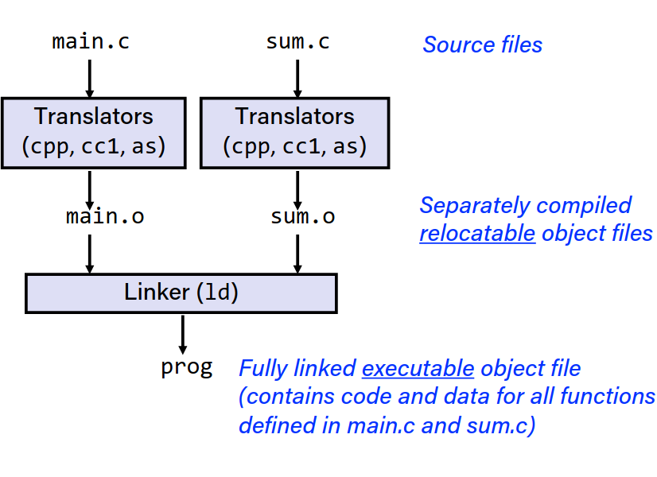
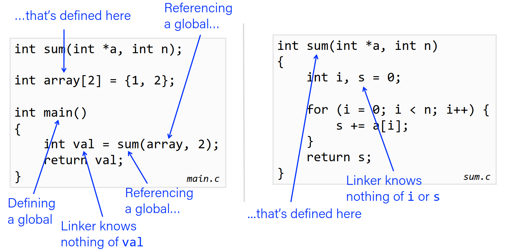
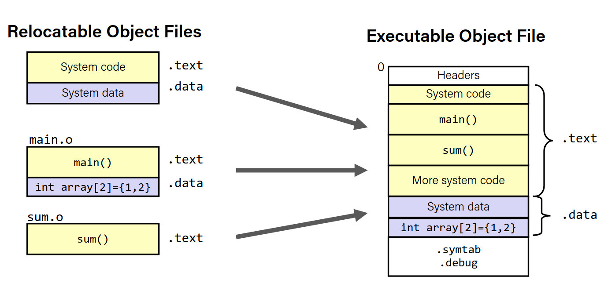
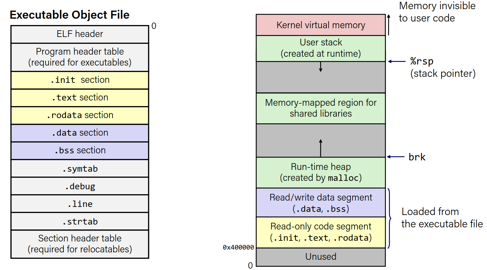
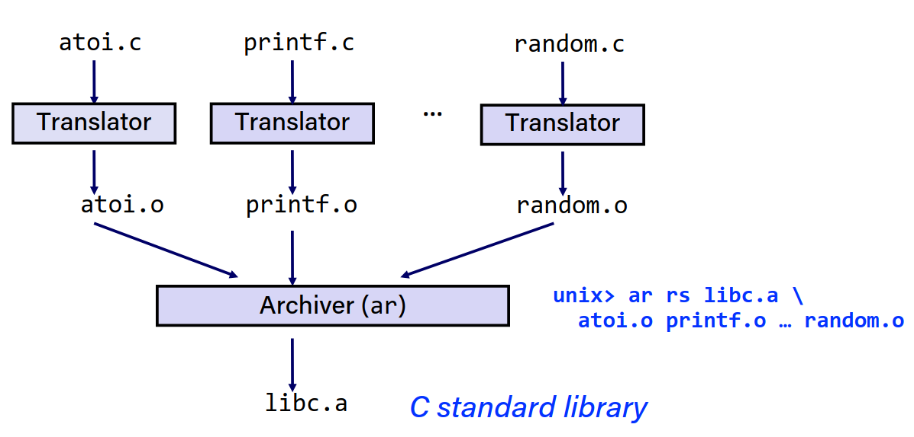
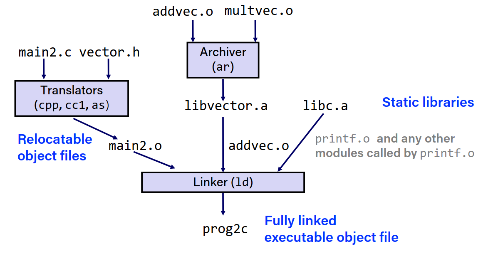
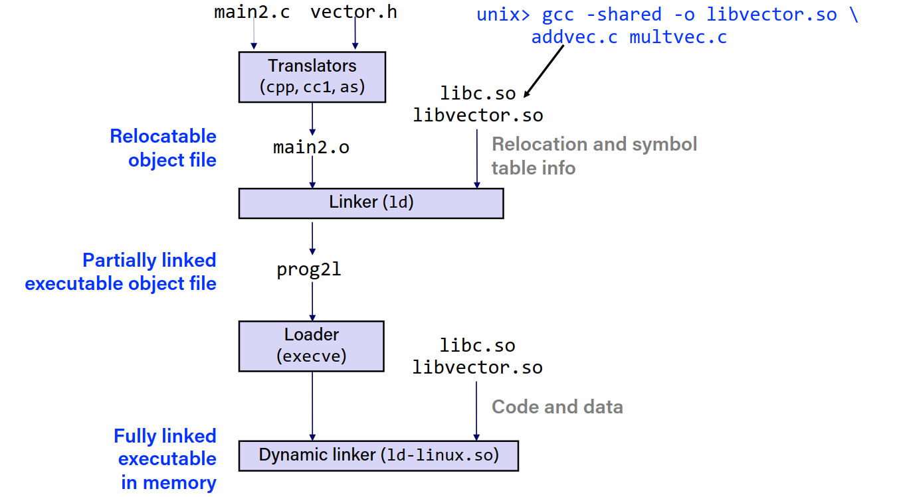

# Linking

## Example C program

```c
int sum(int* a, int n);

int array[2] = {1,2};

int main(){
    int val = sum(array, 2);
    return val;
}
```

```c
int sum(int* a, int n){
    int i = 0;
    int s = 0;
    for(i = 0; i < n; i++){
        s += a[i];
    }
    return s;
}
```

### Static linking

Programs are translated and linked using a *compiler driver*:

```bash
gcc -0g -o prog main.c sum.c
./prog
```


||
|--|
|main.c -> main.o <br> sum.c -> sum.o <br> linker (main.o + sum.o) -> prog

## Why linkers?

Reason1 - Modularity:
-   Program can be written as a collection of smaller source files rather than one large file
-   Can build libraries of common functions (more on this later)

Reason2 - Efficiency:
-   Time: Seperate compilation
    -   Don't need to recomplie unchanged files
    -   Change one source file, recompile than relink
-   Space: Libraries (Shared libraries)
    -   Commonon functions are stored in libraries
    -   Executable files contain code for the functions they actually use

## What do Linkers do?

Step1: **Symbol resolution**
-   Programs define and reference symbols (global variables, functions, etc)
    - `void swap(){} /* define symbol swap */`
    - `swap(); /* reference symbol swap */`
    - `int *xp = &x /\* define symbol xp, reference symbol x */`
-   Symbol definitions are stored in object file (by assembler) in symbol table.
    - Symbol table is an array of structs
    - Each entry includes name, size and location of symbol
    - **During symbol resolution, the linker associates each symbol reference with exactly one symbol definition**

Step2: **Relocation**

- Merges seperate code and data sections into single sections.
- Relocates symbols from their relative locations in the .o file to their final absolute memory locations in the executable.
- Updates references to symbols to point to the new locations.

### Three kinds of object files

- Relocatable object file (.o file)
    - Contains code and data in the form that can be combined with other object files to form an executable file.
        - Each .o file is generated form one .c file

- Executable object file (a.out file)
    - Contains code and data in the form that can be loaded into memory and executed.

- Shared object file (.so file)
    - Special type of relocatable object file that can be loaded into memory and linked with other object files dynamically, at either load time or run time.
    - In windows, .dll files are shared object files.

### Executable and Linkable format (ELF)

- Standart binary format for object files.
- One unified format for:
    - Relocatable object files
    - Executable object files
    - Shared object files
- Generic name: ELF binaries

#### ELF Format

- ELF Header
    - Word size, byte ordering, file type (.o, exec, .so), machine type, etc.
- Segment header table
    - Page size, virtual address memory segments (sections), segment sizes.
- .text section
    - Machine code
- .rodata section
    - Read-only data
- .data section
    - Initialized global and static variables
- .bss section
    - Uninitialized global and static variables
    - "Block started by symbol"
    - "Better save space"
    - Has section header, but no data
- .symtab section
    - Symbol table
    - Procedure and static variables
    - Section names and locations
- .rel.text section
    - Relocation info for .text section
    - Addresses of instructions that will need to be modified in the executable
    - Instructions for modifying
- .rel.data section
    - Relocation info for .data section
    - Addresses of pointer data that will need to be modified it the merged executable
- .debug section
    - Debugging info
- Section header table
    - Offsets and sizes of each section

### Linker Symbols

- Global Symbols
    - Symbols defined by module m that can be referenced by other modules
    - non-static C functions and non-static global variables

- External Symbols
    - Global symbols that are referenced by module m but defined by some other module.

- Local Symbols
    - Symbols defined by module m that are not global symbols.
    - static C functions and static global variables
    - Local linker symbols are not local program variables.

#### Symbol Resolution



#### Local Symbols

- Local non-static C variables vs Local static C variables
    - Local non-static C variables are stored in the stack frame of the function that defines them.
    - Local static C variables are stored in either .bss or .data

<table>
<td>

```c
int f(){
    static int x = 0;
    return x;
}

int g(){
    static int x = 1;
    return x;
}   
```
</td>
<td>

- Compiler allocates space in .data for each definition of `x`

- Creates local symbols in the symbol table with unique names `x.1`, `x.2`, etc.

</td>
</table>

##### A word on static keyword

Static global variables are local variables, they cannot be accessed outside the file they are defined in.
Static variables defined in a function are local to that function, they cannot be accessed outside the function. Furthermore, the function remembers the value of the static variable between calls.

## Resolving Duplicate Symbol Definitions

- Program symbols are either strong or weak
    - Strong: procedures and initialized global variables
    - Weak: uninitialized global variables

<table>
<td>

```c
int foo; // weak symbol
p1(){   //strong symbol

}
```
</td>
<td>

```c
int foo=5; //strong symbol
p2(){   //strong symbol

}
```
</td>
</table>

### Linker's Symbol Rules

- Multiple strong symbols are not allowed
    - Each item can only be defined once
    - Otherwise linker error

- Given a strong symbol and multiple weak symbols, the strong symbol is used
    - Reference to weak symbol is resolved to strong symbol

- If there are multiple weak symbols, pick an arbitrary one
    - Can be disabled with gcc flag `-fno-common`

#### Linker Examples

<table>
<tr>
<td>

```c
int x;
p1(){}
```

</td>
<td>

```c
p1(){}
```

</td>
<td>
Linker Error: Multiple strong symbols!
</td>

</tr>
<tr>
<td>

```c
int x;
p1(){}
```

</td>
<td>

```c
int x;
p2(){}
```

</td>
<td>
References will x will refer to the same uninitialized global variable.<br> 
This might be unintentional.
</td>

</tr>

<tr>
<td>

```c
int x;
int y;
p1(){}
```

</td>
<td>

```c
double x;
p2(){}
```

</td>
<td>
Writes to x in p2 might overwrite y!
</td>

</tr>


<tr>
<td>

```c
int x = 7;
int y = 5;
p1(){}
```

</td>
<td>

```c
double x;
p2(){}
```

</td>
<td>
Writes to x in p2 might overwrite y!
</td>

</tr>

<tr>
<td>

```c
int x = 7;
p1(){}
```

</td>
<td>

```c
int x;
p2(){}
```

</td>
<td>
References to x will refer to the same initialized global variable.
</td>

</tr>

<tr>
<td>

```c
int main(){
}
```

</td>
<td>

```c
int main;
int p2(){}
```

</td>
<td>
Both references to main will refer to the defined main function.
</td>

</tr>

<tr>
<td>

```c
void main(){

}
```

</td>
<td>

```c
int main = 1;
p2(){}
```

</td>
<td>
Error, each module defines a strong symbol main.
</td>

</tr>
</table>

### Global Variables

- Avoid if possible

- Otherwise:
    - Use static when possible
    - Initialize global variables (so that you its harder to mess up)
    - Use extern if you reference an external global variable

## Step 2: Relocation



## Loading Executable Object Files



## Packaging Commonly Used Files

- How to package functions commonly used by multiple programs?
    - Math, IO, etc.

### Old fashioned solution: Static Libraries

- Static Libraries (.a archive files)
    - Concatenated related relocatable object files into a single file with an index
    - Enhance linker so that it tries to resolve unresolved external references by looking for symbols in one or more archives
    - If an archive member file resolves an unresolved external reference, the linker copies the member file into the executable file

#### Creating Static Libraries



- Archiver allows incremental updates.
- Recompile function that changes and replace .o file in archive

##### Linking with Static Libraries

main2.c:
```c
#include <stdio.h>
#include "vector.h"
int x[2] = {1, 2};
int y[2] = {3, 4};
int z[2];
int main(){
    addvec(x, y, z, 2);
    printf("z = [%d %d]\n”, z[0], z[1]);
    return 0;
}
```

libvector.a:

addvec.c:
```c
void addvec(int *x, int *y, int *z, int n) {
    int i;
    for (i = 0; i < n; i++)
        z[i] = x[i] + y[i];
}
```

multvec.c:
```c
void multvec(int *x, int *y, int *z, int n){
    int i;
    for (i = 0; i < n; i++)
        z[i] = x[i] * y[i];  
}
```



#### Using Static Library

- Linker's algorithm for resolving external references:
    - Scan .o files and .a files in the command line order.
    - During the scan, keep a list of the current unresolved references.
    - As each new .o or .a file, obj, is encountered, try to resolve each unresolved
    reference in the list against the symbols defined in obj.
    - If any entries in the unresolved list at end of scan, then error.

Command line order matters!
- Put library files at the end of the command line

### Modern Solution: Shared Libraries

- Static libraries has these disadvantages:
    - Duplication in the stored executables (every function reads libc)
    - Duplication in running executables (every process has its own copy of libc)
    - Minor changes to libc requires recompiling and relinking all executables

- Modern Solution: Shared Libraries
    - Object files that contain code and data that are loaded and linked into an application dynamically, at either *load-time* or *run-time*


- Dynamic linking can occur when executable is first loaded and run (load time linking)
    - Common case for linux, handled automatically by dynamic linker
    - Standart C library is usually dynamically linked
- Dynamic linking can occur when executable is running (run time linking)
    - In linux, done by dlopen() interface.



Dynamic linking at runtime:

```c
#include <stdio.h>
#include <stdlib.h>
#include <dlfcn.h>
int x[2] = {1, 2};
int y[2] = {3, 4};
int z[2];
int main(){
void *handle;
void (*addvec)(int *, int *, int *, int);
char *error;
/* Dynamically load the shared library that contains addvec() */
handle = dlopen("./libvector.so", RTLD_LAZY);
if (!handle) {
    fprintf(stderr, "%s\n", dlerror());
    exit(1);
} 
/* Get a pointer to the addvec() function we just loaded */
addvec = dlsym(handle, "addvec");
if ((error = dlerror()) != NULL) {
    fprintf(stderr, "%s\n", error);
    exit(1);
}
/* Now we can call addvec() just like any other function */
addvec(x, y, z, 2);
printf("z = [%d %d]\n", z[0], z[1]);
/* Unload the shared library */
if (dlclose(handle) < 0) {
    fprintf(stderr, "%s\n", dlerror());
    exit(1);
}
return 0;
} 
```

