# Multiple ways to store program data

- Static global data
    - Fixed size at compile-time
    - Entire lifetime of the program
    - Portion is read-only (string literals)

- Stack data
- Dynamic data

## Running a program

- Create a new process
- Set up adress space/segments
- Read executable file, load instructions, global data
- Libraries loaded on demand
- Set up stack
- malloc in C, will init self on use
    Asks OS for large memory region

Heap memory persistes until the user frees it
Managed by standard C library functions


## Allocating memory

- `#include <stdlib.h>`
- `void *malloc(size_t size)`
    - Allocate `size` bytes of memory
    - Returns a pointer to the allocated memory
        - Typically aligned to 8 bytes (for x86) (or 16 bytes on x86_64)
    - Returns `NULL` if allocation fails
    - Different blocks not guaranteed to be adjacent
- Good Practices
    - Use `sizeof` to make code more portable
    - `void*` is implicitly cast to any pointer type, but explicitly cast for clarity

- We also have calloc, realloc, free (TODO)

# Types of Heap Allocators

- Explicit Allocator: programmer allocates and frees space

- Implicit Allocator: programmer allocates space, but the allocator frees it (garbage collection)

## Dynamic Memory Allocation

- Allocator organizes heap as a collection of variable-sized blocks, which are either allocated or free.
    - Allocator requests pages in the heap region; virtual memory hardware and OS kernel allocate these pages to the process
    - Application objects are typically smaller than pages, so the allocator manages blocks within pages

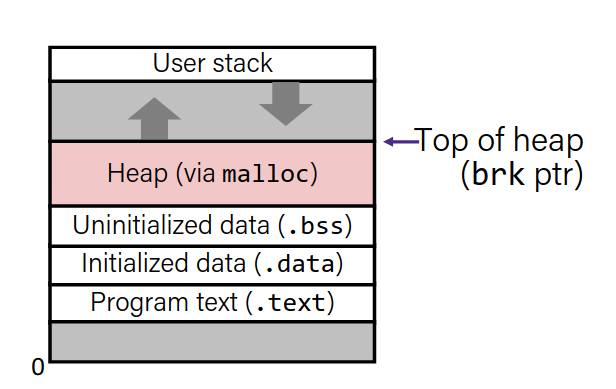

## What is a heap allocator

- A heap allocator is a set of functions that fulfills the requests for heap memory.

- On initialization, it has the starting address and size of the heap region.

- A heap allocator must manage this memory as clients request or no longer need memory.

|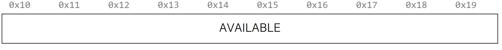|
|-|
|<center>Initial memory</center>|
|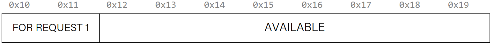|
|<center>A request comes</center>|
||
|<center>Another request comes</center>|
|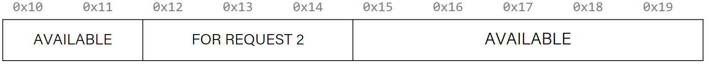|
|<center>Request 1 freed</center>|
|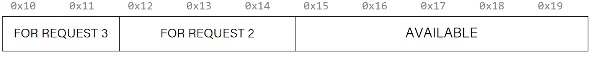|
|<center>A new request comes</center>|
||
|<center>If the space was not enugh</center>|

## Heap Allocator Requirements

A heap allocator:
-   Handle arbitrary request sequences (for allocations and frees)
-   Keep track of which memory is allocated and which is free
-   Decide which memory to provide to fulfill an allocation request
-   Immediately respond to requests without delay
-   Return addresses are aligned to 8 bytes

The heap allocator must remember where are allocated and where are free. 

**Goals:**
-   Maximize throughput (requests per second)
-   Maximize memory utilization (minimize fragmentation)
-   Locality (similar blocks are close to each other)
-   Robust (handle client errors)
-   Ease of implementation/maintenance

### Utilization

The primary cause of poor utilization is fragmentation. Fragmantation happens when unused memory is not able to satisfy allocation requests.

In general, we want the largest address used to be as low as possible.

### Fragmentation

- Poor memory utilization is caused by fragmentation
    - Sections of memory are not used to their full capacity
    - internal and external fragmentation

- Recall: Fragmentation in structs
    - Internal fragmentation was wasted space inside a structs
    - External fragmentation was wasted space between structs

- Fragmentation in the heap
    - Internal fragmentation is wasted space inside a block
    - External fragmentation is wasted space between blocks

#### Internal fragmentation

- For a given block, internal fragmentation happens if the payload is smaller than the block.

- Causes:
    -   Padding for alignment purposes
    -   Overhead of maintaining heap data structures
    -   Explicit policy descisions (return a bigger block than requested)

- This is easy to measure because only depends on the past requests.

#### External fragmentation

- External fragmentation happens when allocation/free pattern leaves *holes* between blocks.
    - The total of lost payload is non-contignous
    - Sometimes there is enough total payload to satisfy a request, but it is not contiguous so it cannot be used.

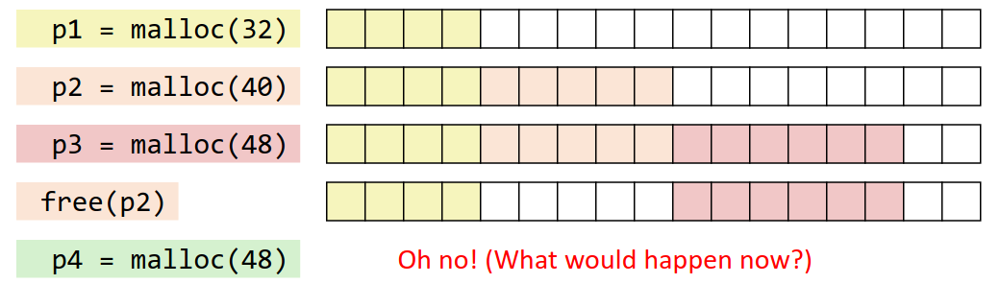


# Heap Allocators

## Bump Allocator

Let's say we want to entirely proiritize throughput and we do not care about utilization or fragmentation. This means we do not care about memory reuse.

-  Bump allocator is a simple heap allocator that allocates memory by bumping a pointer to the next available memory location. (And does nothing about free requests).

- Throughput: each malloc and free execute is only a handful of instructions:
    - Easy to find the next location to use.
    - Free does nothing.

- Utilization: we use each memory block at most once, we do not free at all :moyai:.

Things to consider:
- How to keep track of free blocks?
- How do we choose an appropriate free block to place a new allocation?


### Implementation Issues

- How do we know how much memory to free given just a pointer?
- How do we keep track of free blocks?
- What do we do with the extra space when allocating a structure that is smaller than the free block it is placed in?
- How to reinsert a freed block into the heap?

#### Knowing how much to free

- Standart method
    - Keep the length of a block in the word preceding the data
        - <small>This word is called the header</small>
    - Requires an extra word per block

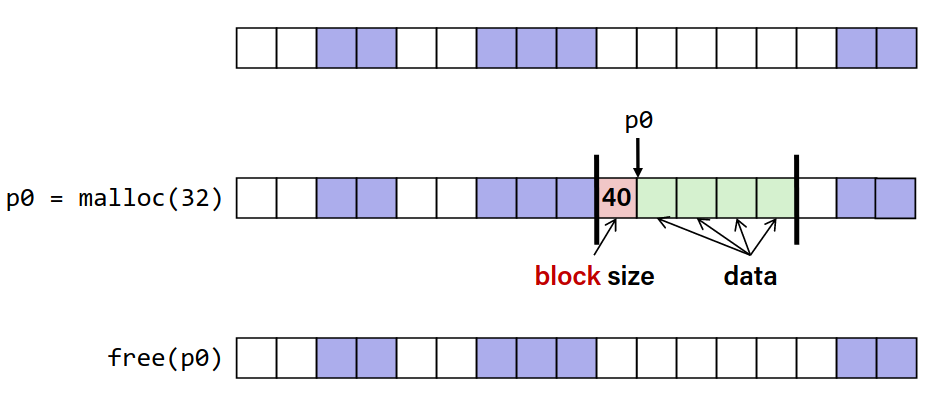

## Implicit Free List Allocator

- Key idea: in order to reuse blocks, we need a way to track which blocks are allocated and which are free.
- We could store this information in a seperate global data structure, but this would be expensive.
- Instead, let's allocate extra space before each block to store this information.
- When we allocate a block, we look through the blocks to find a block that is large enough.
- When we free a block, we update its header and mark it as free.
- The header should be 8 bytes or larger.
- By storing the block size of each block, we implicitly have a free list.

#### Example

```c
void *a = malloc(4);
void *b = malloc(8);
void *c = malloc(4);
free(b);
void *d = malloc(8);
free(a);
void *e = malloc(24);
```
|start|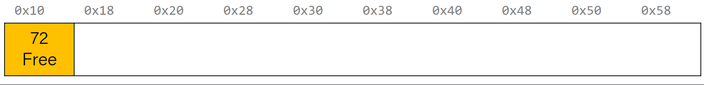|
|-|-|
|`void* a = malloc(4)`|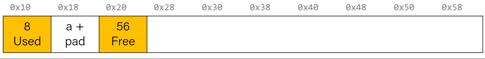|
|`void* b = malloc(8)`|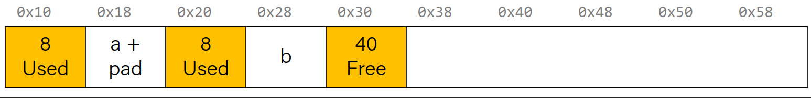|
|`void* c = malloc(4)`||
|`free(b)`|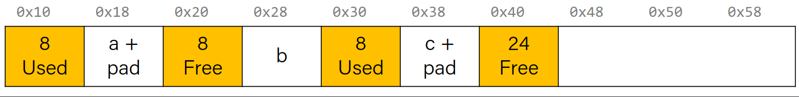|
|`void* d = malloc(8)`||
|`free(a)`||
|`void* e = malloc(24)`|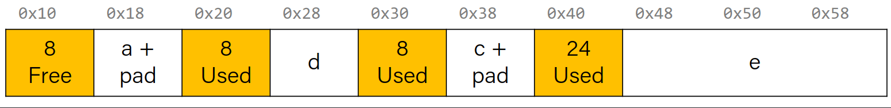|


### Representing headers

- For each block, we need: size, is-allocated?
- We use bit masking:
    - If the blocks are aligned, some low-order bits of size are always 0 (for 8 bytes, the last 3 bits are always 0)
    - Use the lowest bit to indicate whether the block is allocated
    - When reading size, remember to mask out the lowest bit

```c
x = size | a
a = x & 1
size = x & ~1
```


### Finding a free block

- **First fit:** Search from the beginning of the heap for the first block that is large enough
    - Can take linear time in total number of blocks
    - In practice, can cause "splinters" at the beginning of the list
- **Next fit:** Store where the last search left off, and start searching from there
    - Like first fit, but in practice is faster
    - Worse fragmentation
- **Best fit:** Search from the beginning of the heap for the smallest block that is large enough
    - Best free block: large enough and fewest bits left over
    - Small fragmentation
    - Worse throughput

First fit / next fit are easy to implement, but best fit is more complex.


### Practices

- For the following heap layout, what would the heap look like after the following request is made, assuming we are using an implicit free list allocator with a first-fit approach?

[24 byte payload, free] [16 byte payload, free] [8 byte payload, allocated for A]

`void* b = malloc(8);`

[8 byte payload, allocated for B] [8 byte payload, free] [16 byte payload, free]
[8 byte payload, allocated for A]

----------

Same question, but with best-fit approach for the initial memory layout:
[24 byte payload, free] [8 byte payload, free] [8 byte payload, allocated for A]

`void* b = malloc(8);`

[24 byte payload, free] [8 byte payload, allocated for B] [8 byte payload,
allocated for A]

## Splitting Policy

So far, we have seen that a reasonable allocation request splits a free block into an allocated block and a free block with remaining space. What about edge cases?

|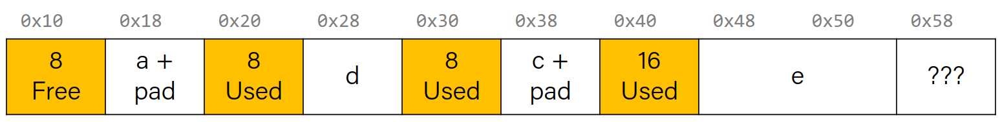|
|-|
|For this initial case, what happens when we call `void* e = malloc(16);`?|

1) We can add extra padding to the end of the block.
    - Internal fragmantation
    - 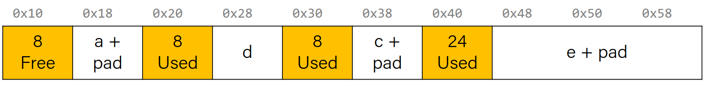
2) We can make a "0 byte free block"
    - External fragmentation
    - 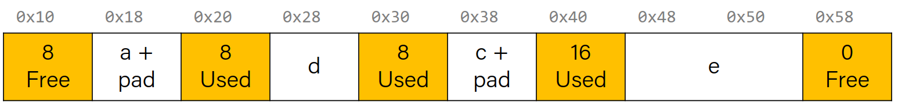

## Coalescing

Explained in explicit allocator.

## In-Place realloc

```c
void* a = malloc(4);
void* b = realloc(a, 8);
```

What happens:

|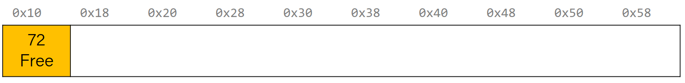|
|-|
|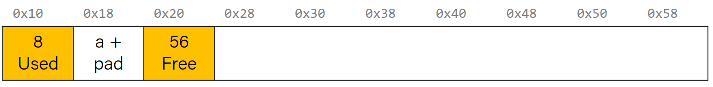|
|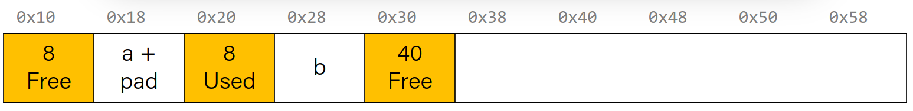|

Implicit list cannot do in-place realloc, explicit one must be able to do that one.