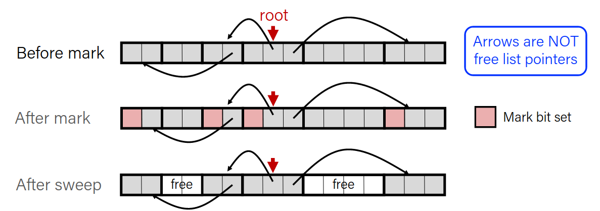

# Explicit free list allocator

## What to do better?

- It would be nice if we could jump *jut between free blocks* instead of all blocks to find a block to reuse.

- Idea: let's modify each header to add a pointer to the previous free block and a pointer to the next free block.

This multiplies the size of each header by 3, too inefficient. 

- Insight: Payloads of free blocks are not used. Since we only need to store these pointers for free blocks, let’s store them in the first 16 bytes of each free block’s payload!

- Each payload must be big enough to store 2 pointers (16 bytes). So we must require that for each block, free and allocated.

## Explicit Free List


Use lists of free blocks instead of implicit list of all blocks.

- The next free block can be anywhere in the heap
- Since we only track free blocks, we can use payload for pointers
- Still we need boundary tags for coalescing

- When we allocate a block, we look through just the free blocks using our linked list to find a fitting one, and we update its header and the linked list to reflect its allocated size and that it is now allocated.

- When we free a block, we update its header to reflect it is now free and **update the linked list**

Explicit list increases request throughput by paying design and internal fragmantation as cost.

### List Design

How to organize the linked list:
- Access-order
    - Better memory util, Linear free
- Last-in First-out
    - Constant free 

<table>
<tr>
<td>

**Implicit List**
</td>

<td>

**Explicit List**
</td>
</tr>

<tr>

<td>

- 8B header size + alloc/free status
- Allocation requests are worst-case linear in total number of blocks
- Implicitly address-order
</td>

<td>

- 8B header for size + alloc/free status
- Free block payloads store prev/next free blocks
- Allocation requests are worst-case linear in total number of free blocks
- Can choose block ordering

</td>


</tr>


</table>

### Coalescing

When we free, we combine adjacent free blocks.
For explicit heap allocator, we should coalesce if possible when possible when a block is freed. 
We only need to coalesce with the most immediate right neighbour.

### Realloc

- Sometimes we can keep the data in the same place:
    - size is growing, but we added padding so the data fits
    - size is shrinking so we can use the same block
        - If we can, we should try to recycle the now-freed memory into another freed block.
    - size is growing and the current block does not work, but the next block is free and big enough

### Practice

- For the following heap layout, what would the heap look like after the following request is made, assuming we are using an explicit free list allocator with a first-fit approach and coalesce on free + realloc in-place?

[24 byte payload, allocated for B] [16 byte payload, free] [16 byte payload, allocated for A]

`free(B);`

[48 byte payload, free] [16 byte payload, allocated for A]

----------

- For the following heap layout, what would the heap look like after the following request is made, assuming we are using an explicit free list allocator with a first-fit approach and coalesce on free + realloc in- place?

[16 byte payload, allocated for A] [32 byte payload, free] [16 byte payload, allocated for B]

`realloc(A, 24);`

[24 byte payload, allocated for A] [24 byte payload, free] [16 byte payload, allocated for B]

### Explicit list with buckets

- Explicit lists are much faster than implicit lists
- However, a first-fit placement policy is still linear in the number of free blocks
- What about an explicit free list **sorted by size** (as a tree)
- What about an explicit free list **bucketed by size**


# Garbage Collection

- Automatic reclamation of heap allocated memory that can no longer be accessed.

```c
void foo(){
    int* p = malloc(128);
    return; // p is garbage now
}
```

In general, we cannot know what is going to be used in the future since it depends on conditionals.

But we can tell that certain blocks cannot be used if they are unreachable.

- Memory allocator needs to know what is a pointer and what is not.

## Memory as a graph

- We view memory as a directed graph
    - Each allocated heap block is a node in the graph
    - Each pointer is an edge in the graph
    - Locations not in the heap that contain pointers into the heap are called root nodes (e.g. registers, stack locations, global variables)


- Dynamic memory allocator can free blocks if there are no pointers to them.

- We will make assumptions about pointers:
    - Memory allocator can distinguish pointers from non-pointers
    - All pointers point to the start of the block in the heap
    - Application cannot hide pointers (by turning them to long etc.)

## Mark and Sweep collecting

- Can build on top of malloc, free package
    - malloc until you run out of place

- When out of space:
    - Use extra mark bit in the header of each block
    - Mark: Start at roots and set mark bit on each reachable block
    - Sweep: Scan all blocks and free blocks that are not marked



### Assumptions for a simple implementation

- Application can use functions to allocate memory:
    - `b = new(n)` returns pointer b, to new block with all locations cleared
    - `b[i]` read location i of block b
    - `b[i]=v` write v into location i of block b

- Each block will have a header word (accessed at `b[-1]`)

- Functions used by the garbage collector:
    - `is_ptr(p)` determines whether p is a pointer to a block
    - `length(p)` returns length of block pointed to by p, not including header
    - `get_roots()` returns all the roots

### Marking

- Mark using depth-first traversal of the memory graph

```c++
ptr mark(ptr p) {                   // p: some word in a heap block
    if (!is_ptr(p)) return;         // do nothing if not pointer
    if (markBitSet(p)) return;      // check if already marked
    setMarkBit(p);                  // set the mark bit
    for (i=0; i<length(p); i++)     // recursively call mark on
        mark(p[i]);                 // all words in the block
    return;
}
```

### Sweeping

- Sweep using sizes in headers

```c++
ptr sweep(ptr p, ptr end) { // ptrs to start & end of heap
    while (p < end) { // while not at end of heap
        if (markBitSet(p)) // check if block is marked
            clearMarkBit(p); // if so, reset mark bit
        else if (allocateBitSet(p)) // if not marked, but allocated
            free(p); // free the block
        p += length(p); // adjust pointer to next block
}
}
```

### Conservative Mark and sweep in C

- In C, pointers can point to the middle of allocated blocks, so is_ptr would not really work.

- There are ways to do this in C but the resulting garbage collector is conservative:
    - Every reachable node correctly identified as reachable, but some unreachable nodes might be incorrectly marked as reachable

- In java, all pointers point to the starting address of an object structure - the start of a block.

